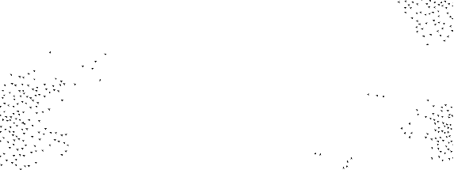
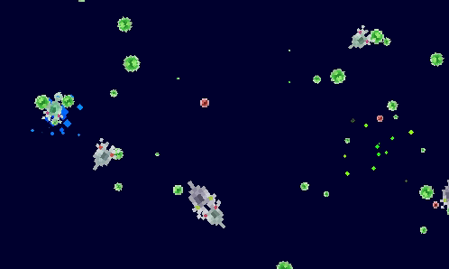
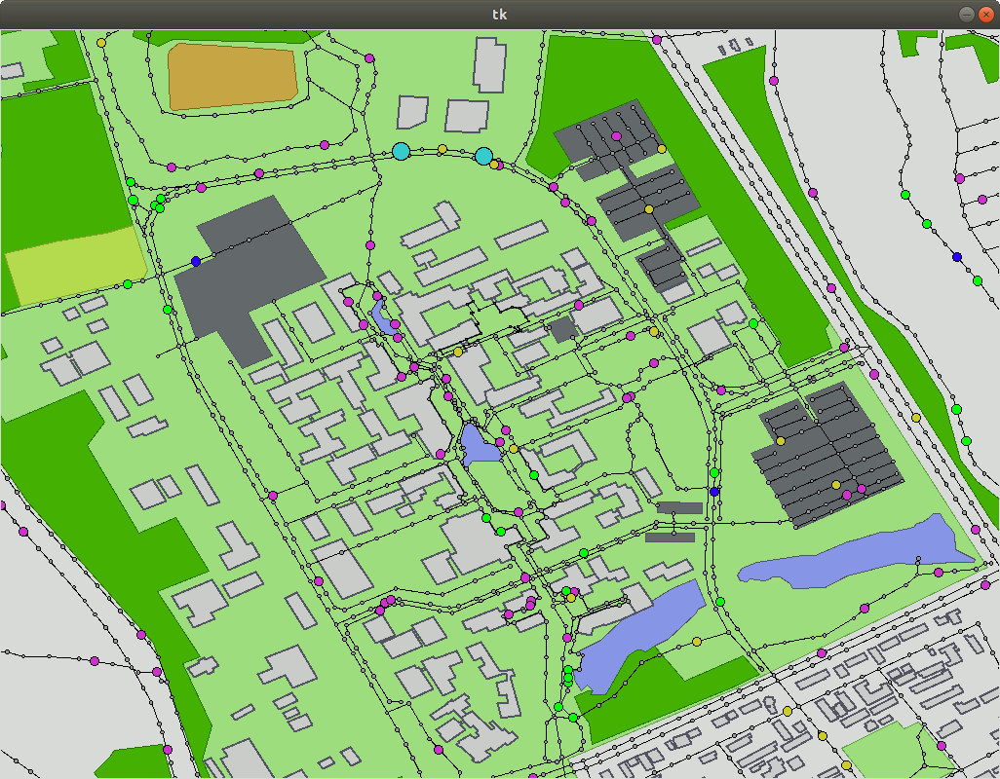
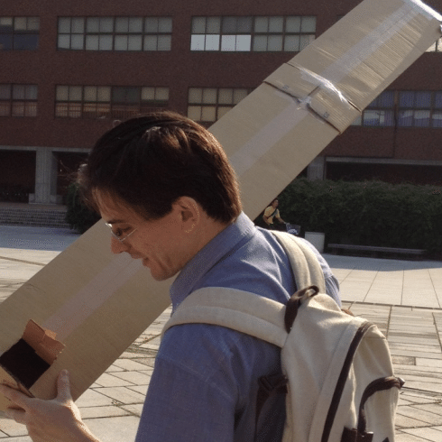
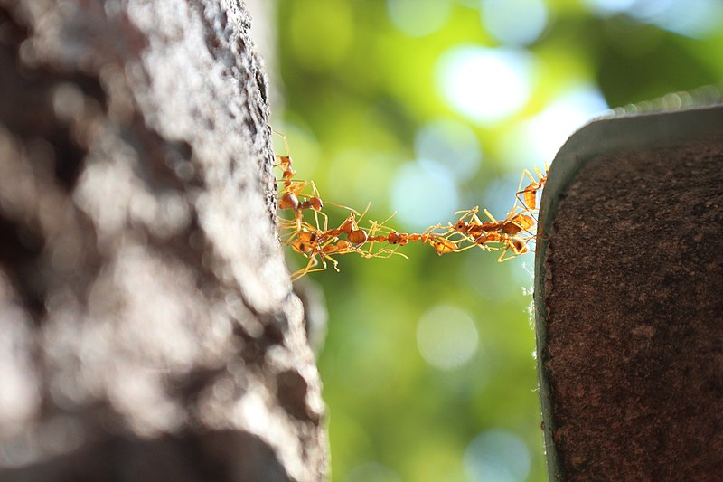
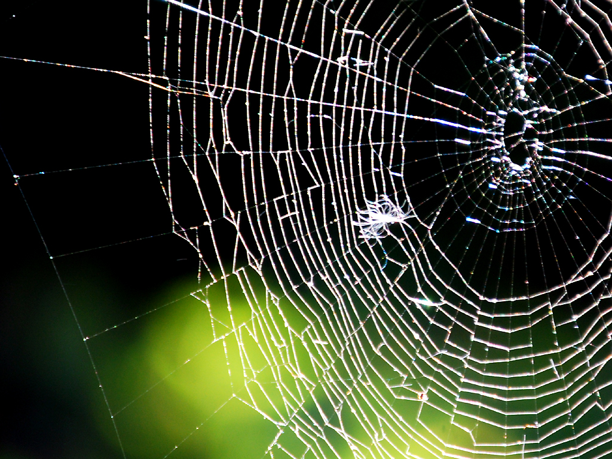
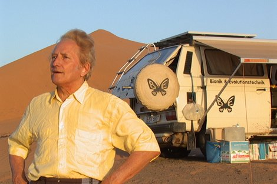
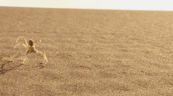
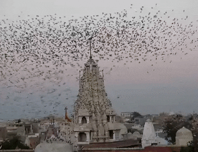
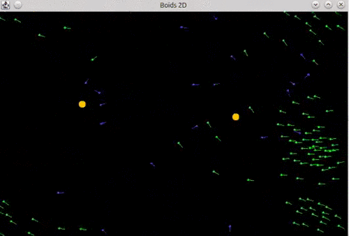

name: title
class: center, middle

# Introduction to Bioinspired Computation
## Lecture 01: Artificial Life
Claus Aranha, University of Tsukuba

---
name: toc

# Outline for Today:

## Part 01 - Introduction
- About this course:
  - Course Goals,
  - Class Format,
- What is Bioinspired Computation?

## Part 02 - Introduction to Artificial life (Alife)
- Basic Concepts of Alife
- Examples of Alife Systems
- "Life as it could Be"

## Part 03 - Hands-on Practice with Alife Projects
<!-- - Game of Life, Avida, and "The Bibites" -->

---
layout: false
class: center, middle

# Part 01

# Welcome to the Course!

---
layout: true

.sectionname[**Part 01.01**: Welcome to the Course!]

---

# The goal of this course

.cols[
.c80[
**Artificial Intelligence** (AI) is an extremely hot topic today. All researchers
want to do it, all companies want to buy it, all governments want to use it!

However, there are so many different views of AI that sometimes it is hard to
actually understand what it is, where it came from, and **what it could be**.
]
.c30[
.right[]
]]

In this course I want to give you a _wide_ view of topics related "Artificial Intelligence", today and in the past, beginning with the fundamental ideas of **Bioinspired Computation** and **Artificial Life** (Alife).

I hope you can learn some fun and inspiring ideas in this course!

.boxyellow[
.boxlabel[Fun note]

One of the motivations behind this material is to help onboard new
students to my laboratory. So if you do enjoy these topics, do consider joining
our group in the future 😀]

---

# Some cool things that we will study

.cols[
.c30[
  .center[Virtual Creatures

  
  *The Bibites*
  ]

]
.c30[
  .center[Robots that Evolve

  

  
  *Soft Robots*
  ]
]
.c30[
  .center[Simulated Societies

  
  *Tsukuba Evacuation Sim*
  ]
]
]

---

# About the Lecturer

.pull-left[
- **Name**: Claus Aranha (🕷)
- **Origin**: Brazil 🇧🇷

- **Things I like**: ❤
  - Spiders 🕷 and Zombies 🧠
  - Virtual Worlds: Games and Books;
  - Space, Astronomy, etc 👽
  - Programming ⌨

- **Academic History**: 🎓
  - First heard about AI from Asimov in HS;
  - Comp Sci degree in 2001, MEXT Scholar;
  - Teaching in Tsukuba from 2012,

]

.pull-right[

]

---

# About yourselves

.largetext[
- What is your name?

- Talk about your non-academic background:
  - What are your hobbies, interests, things that make you happy?

- Talk about your academic background:
  - What is your area? Why is this area interesting?

- What do you expect of this course?
]

---

# Format of our classes:

.largetext[
Each day focuses on one large topic:

- Morning Session: Lectures and discussion
  - Understanding the basics;
  - Learning interesting examples;
  - Research project overview;

- Afternoon Session: Hands-on Practice
]

---

# Main topics of the Course:

.largetext[
- **Day 1**: Artificial Life .greentext[<-- Today!]

- **Day 2**: Evolutionary computation

- **Day 3**: Multi Agent Systems

- **Day 4**: Neural Networks and Machine Learning

- **Day 5**: Group work and presentation
]

---

# Important: Stop me to ask questions!

.largetext[
The four topics of this course are .redtext[huge]. It is
impossible to cover everything in five days.

So I want to focus on the .greentext[interesting parts].

If you want to know more about something,  
or if you want to ask a question, **please ask it right away!**.

It will be more fun if we have an active conversation!
]

---

# Report and Grading

.largetext[
This course will be graded on a report. (Deadline, October 13th)

In this report, you will write a **research proposal** using the topics
presented in this course, **and your own study field**.

Think interdisciplinarity!

On Friday you will make a short presentation about your idea for
the report. I will give feedback on your idea for your report.

More details Friday!]

---

# Extra Reading
.cols[
.col75[
.largetext[
I listed many suggested reading materials in the course page.

(Including books, papers, blogs and novels!)

Make sure to read them to complement your knowledge!
]
]
.col25[
.center[]
]
]

.right[*Time for a short break...*]

---
layout: true

.sectionname[**Part 01.02**: BioInspired Computation]

---

# What is Bioinspired Computation?

.cols[

.c30[
.center[

*Margareth Hamilton, Software Lead of the Apollo Program*
]
]

.c70[
Usually, when we think of computing systems, we think of projects carefully built from mathematics and engineering to solve some human need.

We see these artificial artifacts as extremely useful, and possessing design and abilities unlike anything found in the natural world.

The artificial is clean, organized, and helpful. While the natural is messy and chaotic and a bit of a mistery.
]
]

---

# Being Inspired by Nature

On the other hand, natural creatures sometimes exhibit incredible abilities!

.cols[
.c20[

]
.c30[
**Ants:**
- Pheromone communication
- Cooperative hunting / building
- Stigmergy
]
.c20[

]
.c30[
**Spiders:**
- Nests capture prey
- Spider mind games
- Spider silk strength
- Flexible movement
]
]

.greentext[And many others!] We should draw inspiration from the natural world to build our systems!

**Bioinspired Computation** are disciplines that try to reproduce these abilities in computing systems.

---

# Bioinspired Examples

.largetext[

Let's look at two examples of bio-inspired systems:

- "*Tabbot*": A robot inspired by spider's movement;

- "*Boids*": A CG system inspired by flocks of birds;
]

---

# Bioinspired System example 01: Tabbot

.cols[
  .c40[

  - **Ingo Rechenberg** was a German scientist who wanted to develop robots capable of navigating extreme terrain conditions, such as deserts.

  
  ]
  .c30[

  

  In the Sahara desert, he found the "somersaulting spider", which used this jumping motion to flee from predators in high speed.

  ]
  .c30[

  - Based on the spider's somersault, he developed a robot that can move quickly on sand.

  
  ]
]

---

# Bioinspired System example 01: Tabbot

.center[]

---

# Being Inspired by Nature: Example 02 Boids

.cols[
.c50[
.center[]
]
.c50[
.center[]
]
]

.greentext[Boids] is a Computer Graphics system design to look like a flock of birds. The movement of each bird is defined by **three simple rules**.

---

# How do boids move?

.cols[
.c30[
- Inspired by how birds flock together without .redtext[explicit communication], the Boids system also avoids using a central controller for the movement.

- Each boid moves following .greentext[three simple rules], using only the information that it can sense nearby.
]
.c10[]
.c60[
**The three Boids rules:**

Rule 1: **Cohesion**: Move towards the swarm

Rule 2: **Avoidance**: Move away from others

Rule 3: **Alignment**: Align direction
]
]

---

# Boids and Emergence

By adding together **three simple rules**, and **decentralized decision making**, the Boids system achieves **complex, life-life behavior**!

.center[.largetext[
 +  +  = 
]]

When the interaction of simple rules or individuals cause complex behavior in a system, we call it **emergence**.

**Emergence** is an important and desirable characteristics of bioinspired systems!

---

# Boids in the theater

.center[]

.largetext[
This is a scene from *Lord of the Rings: The Two Towers (2002)*.  
The CG soldiers in this scene move using a boids-like system.
]

---

# Bioinspired computation and this course

- All the technologies we will see in this course are, in one way or another, inspired by natural processes.

  - Evolutionary Computation: Natural Evolution;
  - Multi Agent Systems: Insects Swarms, social animals;
  - Neural Networks: Brain cells;
  - Artificial Life: Well... everything!

.boxyellow[
.boxlabel[Discussion time!]

- What are natural processes that inspire you?
- What kind of bio-inspired technology you would like to see in the world?

]

.right[**Time for a longer break!**]

---
layout: false
class: center, middle

# Part 02

# Introduction to Artificial Life

---
layout: true

.sectionname[**Part 02.01**: Introduction to Artificial Life]

---

# What is Artificial Life?

- Reproducing life-like systems to understand life.
- "Life as it could be"

---

# How can we represent "Life" in a computer?

Example: Conway's "Game of Life"

---

# Explaining the Game of Life

---

# Playing with the Game of Life

---

# What can we do with the Game of Life?

- Beautiful patterns
- Computation

---

# What can we do with the Game of life?
(Life inside Life)

---

# How is the Game of Life similar to life?

- Complexity from simple rules
- Similarity with chemistry
- Emergence of complex systems

---

# Is the Game of Life really Life?

What is life? That is a very hard question, and answering that question is
one of the research goal of Artificial Life.

The fact that even the simple Game of Life can make us think about this
is very important.

---
layout: true

.sectionname[**Parts 02.02**: Types of Alife]

---

# Types of Artificial Life

Artificial Life research is usually divided in three large areas, depending on
the type of approached used to produce the life-like system.

- "Soft Alife"
- "Hard Alife"
- "Wet Alife"

---

# Questions of Artificial Life

- Understanding Life
- Creating Life
- Imagining Life

---
layout: true

.sectionname[**Part 02.02:** Artificial Life Systems]

---

# Artificial Life Systems

We will study a few examples of Artificial Life Systems, and what we can learn
from them.

---

# Diffusion Systems

---

# Self-Replicating Systems

- Cellular Automata
- Self-replicators
  - Self-replications and evolution (more next class!)
- Artificial Chemistry

---

# Artificial Biology

- Avida: Replication of cells, genes and evolution

---

# Agency Systems

- What is Agency?
- Agency of Simple Robots
- Non-intelligent system with Agency (Oil Drops and Crystal)
- Agency and Human iteraction

---

# Alife Simulations

- More complex systems trying to replicate life

---
layout: false
class: center, middle

# Part 03: Hands-on Practice

---
layout: true

.right[Section 03: Hands-on practice]

---

# Hands-on Experimentation with Alife Systems

In this section, I will introduce the following three systems in more detail.
You are invited to explore these systems by yourself, make your own discoveries,
and exchange your impressions with others in the class.

- Game of Life
- Avida
- The Bibites

---

# Game of Life Simulation

- What is?
- How to use?
- Tasks: Create a long pattern, create a stable pattern, try to create a pattern that generates other patterns.

---

# Avida-edu Simulation

- What is?
- How to use?
- Tasks: Evolution competition. Measure the length of genomes in winning populations. Identify why a mutation becomes dominant.

---

# The Bibites Simulation

- What is?
- How to use?
- Tasks: Run at advanced speed, and give a name to interesting mutations. Observe which characteristics are helpful or nocive to the creatures. Observe when new mutations start to dominate the population (may take some time!)

---

# Your task for the rest of the day:

Form pairs or trios, and choose one of the three simulators to explore.

Try to do the tasks suggested, but also explore following your interests and curiosity.

Exchange ideas with your group mates about what you are seeing, and what it could be used for.
