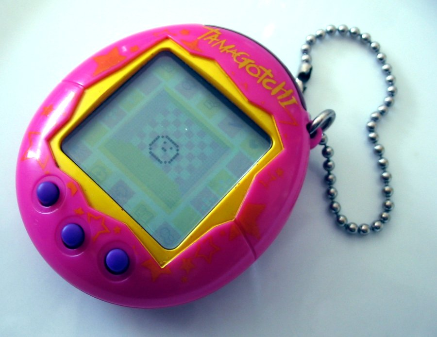
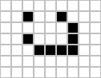
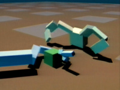

name: title
class: center, middle

# Introduction to Bioinspired Computation
## Lecture 01: Artificial Life
Claus Aranha, University of Tsukuba

---
name: toc

# Outline for Today:

## Part 01 - Introduction
- About this course:
  - Course Goals,
  - Class Format,
- What is Bioinspired Computation?

## Part 02 - Introduction to Artificial life (Alife)
- Basic Concepts of Alife
- Examples of Alife Systems
- "Life as it could Be"

## Part 03 - Hands-on Practice with Alife Projects
<!-- - Game of Life, Avida, and "The Bibites" -->

---
layout: false
class: center, middle

# Part 01

# Welcome to the Course!

---
layout: true

.sectionname[**Part 01.01**: Welcome to the Course!]

---

# The goal of this course

.cols[
.c80[
**Artificial Intelligence** (AI) is an extremely hot topic today. All researchers
want to do it, all companies want to buy it, all governments want to use it!

However, there are so many different views of AI that sometimes it is hard to
actually understand what it is, where it came from, and **what it could be**.
]
.c30[
.right[]
]]

In this course I want to give you a _wide_ view of topics related "Artificial Intelligence", today and in the past, beginning with the fundamental ideas of **Bioinspired Computation** and **Artificial Life** (Alife).

I hope you can learn some fun and inspiring ideas in this course!

.boxyellow[
.boxlabel[Fun note]

One of the motivations behind this material is to help onboard new
students to my laboratory. So if you do enjoy these topics, do consider joining
our group in the future 😀]

---

# Some cool things that we will study

.cols[
.c30[
  .center[Virtual Creatures

  
  *The Bibites*
  ]

]
.c30[
  .center[Robots that Evolve

  

  
  *Soft Robots*
  ]
]
.c30[
  .center[Simulated Societies

  
  *Tsukuba Evacuation Sim*
  ]
]
]

---

# About the Lecturer

.pull-left[
- **Name**: Claus Aranha (🕷)
- **Origin**: Brazil 🇧🇷

- **Things I like**: ❤
  - Spiders 🕷 and Zombies 🧠
  - Virtual Worlds: Games and Books;
  - Space, Astronomy, etc 👽
  - Programming ⌨

- **Academic History**: 🎓
  - First heard about AI from Asimov in HS;
  - Comp Sci degree in 2001, MEXT Scholar;
  - Teaching in Tsukuba from 2012,

]

.pull-right[

]

---

# About yourselves

.largetext[
- What is your name?

- Talk about your non-academic background:
  - What are your hobbies, interests, things that make you happy?

- Talk about your academic background:
  - What is your area? Why is this area interesting?

- What do you expect of this course?
]

---

# Format of our classes:

.largetext[
Each day focuses on one large topic:

- Morning Session: Lectures and discussion
  - Understanding the basics;
  - Learning interesting examples;
  - Research project overview;

- Afternoon Session: Hands-on Practice
]

---

# Main topics of the Course:

.largetext[
- **Day 1**: Artificial Life .greentext[<-- Today!]

- **Day 2**: Evolutionary computation

- **Day 3**: Multi Agent Systems

- **Day 4**: Neural Networks and Machine Learning

- **Day 5**: Group work and presentation
]

---

# Important: Stop me to ask questions!

.largetext[
The four topics of this course are .redtext[huge]. It is
impossible to cover everything in five days.

So I want to focus on the .greentext[interesting parts].

If you want to know more about something,  
or if you want to ask a question, **please ask it right away!**.

It will be more fun if we have an active conversation!
]

---

# Report and Grading

.largetext[
This course will be graded on a report. (Deadline, October 13th)

In this report, you will write a **research proposal** using the topics
presented in this course, **and your own study field**.

Think interdisciplinarity!

On Friday you will make a short presentation about your idea for
the report. I will give feedback on your idea for your report.

More details Friday!]

---

# Extra Reading
.cols[
.col75[
.largetext[
I listed many suggested reading materials in the course page.

(Including books, papers, blogs and novels!)

Make sure to read them to complement your knowledge!
]
]
.col25[
.center[]
]
]

.right[*Time for a short break...*]

---
layout: true

.sectionname[**Part 01.02**: BioInspired Computation]

---

# What is Bioinspired Computation?

.cols[

.c30[
.center[

*Margareth Hamilton, Software Lead of the Apollo Program*
]
]

.c70[
Usually, when we think of computing systems, we think of projects carefully built from mathematics and engineering to solve some human need.

We see these artificial artifacts as extremely useful, and possessing design and abilities unlike anything found in the natural world.

The artificial is clean, organized, and helpful. While the natural is messy and chaotic and a bit of a mistery.
]
]

---

# Being Inspired by Nature

On the other hand, natural creatures sometimes exhibit incredible abilities!

.cols[
.c20[

]
.c30[
**Ants:**
- Pheromone communication
- Cooperative hunting / building
- Stigmergy
]
.c20[

]
.c30[
**Spiders:**
- Nests capture prey
- Spider mind games
- Spider silk strength
- Flexible movement
]
]

.greentext[And many others!] We should draw inspiration from the natural world to build our systems!

**Bioinspired Computation** are disciplines that try to reproduce these abilities in computing systems.

---

# Bioinspired Examples

.largetext[

Let's look at two examples of bio-inspired systems:

- "*Tabbot*": A robot inspired by spider's movement;

- "*Boids*": A CG system inspired by flocks of birds;
]

---

# Bioinspired System example 01: Tabbot

.cols[
  .c40[

  - **Ingo Rechenberg** was a German scientist who wanted to develop robots capable of navigating extreme terrain conditions, such as deserts.

  
  ]
  .c30[

  

  In the Sahara desert, he found the "somersaulting spider", which used this jumping motion to flee from predators in high speed.

  ]
  .c30[

  - Based on the spider's somersault, he developed a robot that can move quickly on sand.

  
  ]
]

---

# Bioinspired System example 01: Tabbot

.center[]

---

# Being Inspired by Nature: Example 02 Boids

.cols[
.c50[
.center[]
]
.c50[
.center[]
]
]

.greentext[Boids] is a Computer Graphics system design to look like a flock of birds. The movement of each bird is defined by **three simple rules**.

---

# How do boids move?

.cols[
.c30[
- Inspired by how birds flock together without .redtext[explicit communication], the Boids system also avoids using a central controller for the movement.

- Each boid moves following .greentext[three simple rules], using only the information that it can sense nearby.
]
.c10[]
.c60[
**The three Boids rules:**

Rule 1: **Cohesion**: Move towards the swarm

Rule 2: **Avoidance**: Move away from others

Rule 3: **Alignment**: Align direction
]
]

---

# Boids and Emergence

By adding together **three simple rules**, and **decentralized decision making**, the Boids system achieves **complex, life-life behavior**!

.center[.largetext[
 +  +  = 
]]

When the interaction of simple rules or individuals cause complex behavior in a system, we call it **emergence**.

**Emergence** is an important and desirable characteristics of bioinspired systems!

---

# Boids in the theater

.center[]

.largetext[
This is a scene from *Lord of the Rings: The Two Towers (2002)*.  
The CG soldiers in this scene move using a boids-like system.
]

---

# Bioinspired computation and this course

- All the technologies we will see in this course are, in one way or another, inspired by natural processes.

  - Evolutionary Computation: Natural Evolution;
  - Multi Agent Systems: Insects Swarms, social animals;
  - Neural Networks: Brain cells;
  - Artificial Life: Well... everything!

.boxyellow[
.boxlabel[Discussion time!]

- What are natural processes that inspire you?
- What kind of bio-inspired technology you would like to see in the world?

]

.right[**Time for a longer break!**]

---
layout: false
class: center, middle

# Part 02

# Introduction to Artificial Life

---
layout: true

.sectionname[**Part 02.01**: What is Artificial Life?]

---

# What is Artificial Life?

.center[
`"To study life by reproducing it in silico."`

`"Life as it could be."`

]

---

# Alife: To create Life Forms Artificially

.largetext[But what is Life? Something that grows and reproduces?]

.cols[
.c70[
.center[
Salt crystals grow, and they create new crystals

]
]
.c30[
.center[
Videogame creatures grow and reproduce too.

]
]
]

---

# What separates "Life" from "Non Life"?

.largetext[
- Ability to grow and reproduce?

- Interact with the environment?
  - **Purposefully** interact with the environment?

- To have some sort of chemistry?

- To have a constant existence?

- To be an entropy-negative system?

**Defining Life is already a hard research problem!**
]

---

# Don't forget to feed your Tamagochi

.cols[
.c30[

]
.c70[
- Very popular toy in the 90ies.

- A virtual pet. It had to be fed, cleaned, and played with every day.

- If you forget to feed your tamagochi, it dies.

- Many people formed bonds with their tamagochi.

- It was pretty cool.
]
]

Should we consider the tamagochi "alive"?
- If yes, what are the implications? "Tamagochi abuse"?
- If not, why not? What are the conditions to life?

Considering these questions is the key to "Alife"!

.footnote[[Image by Tomasz Sienick, Wikipedia](https://en.wikipedia.org/wiki/Tamagotchi#/media/File:Tamagotchi_0124_ubt.jpeg)]

---

# Don't forget microscopic life either!

.largetext[Tamagochi and robots are cute, but **the majority of life on earth is invisible to our eyes**.]

.cols[
.c60[
Microorganisms:
- Majority of life on earth
- Not cute
- Can't play with us
- Still definitely alive.

What makes life different from chemistry?

What is the difference between a petri-dish full of protein, and one full of bacteria?

Asking these questions is another part of Alife!
]
.c40[

*Xenobots*, artificial creatures.
]
]

.footnote[Image from [NPR](https://www.npr.org/2021/12/01/1060027395/robots-xenobots-living-self-replicating-copy)]

---

# Why Artificial Life?

.cols[
.c20[
.right[]
Public Domain picture by the Hubble Telescope
]
.c80[
.largetext[
- **Build something to understand it**:  
Trying to build "life" systems, we learn more about the requisites to life.

- **Life as it could be**:  
As we consider the limits of what life is and is not,   
we imagine how life could develop in extreme environments.

- **Creating Eternal Art**:  
Creating an artificial system that has all the creativity and exuberance of life.
]
]
]

---

# Discussion: What is Life?

.largetext[
- What are the characteristics of a living system?

- What are the open questions about life?

- What could be the applications of an artificial life form?
]

.right[**Time for a quick break!**]

---
layout: true

.sectionname[**Part 02.02**: Conway's Game of Life]

---

# Example of Alife system: Conway's Game of Life

.center[]

---

# What is the game of Life?

.largetext[
The game of life is a **mathematical construct** that presents characteristics that are similar to those of living systems, such as **complexity**, **emergence** and **chaos**.

For over 50 years, many people have studied its properties.

It is also quite fun!
]

.right[]

---

# Rules of the Game of Life (1/2)

.right[]

.largetext[
- Grid of cells. Each cell can be .greentext[live] or .redtext[dead].

- Each step, the state of each cell is updated based on its neighbors.  
(local information, like boids)

- This computation can be done by hand, or simulated.

- A system like this is called **Cellular Automata**
]

---

# Rules of the Game of Life (2/2)

.cols[
.c70[
.largetext[
1. .redtext[A live cell with less then 2 neighbors becomes dead.]

2. .greentext[A live cell with 2 or 3 neighbors stays alive.]

3. .redtext[A live cell with more than 3 neighbors becomes dead.]

4. .greentext[A dead cell with 3 neighbors becomes alive.]
]

]
.c30[
.right[]
]
]

.footnote[Image source unknown, found all over the net. Any information appreciated!]
---

# Patterns in the Game of Life

The rules of the game of life are very simple, but they can give rise to an enormous variety of patterns.

.cols[
.c40[
- Stable Patterns

- Periodic Patterns

- Chaotic patterns

- Gliders

- Glider Guns
]
.c30[

]
.c30[

]
]

.footnote[[Wikipedia Article on the Game of Life](https://en.wikipedia.org/wiki/Conway%27s_Game_of_Life)]

---

# Let's play with the Game of Life!

.center[
https://copy.sh/life/

]

.largetext[
- Try to build the patterns in the last slide;
- Try to build the smallest pattern that expands forever;
- Try to build pretty patterns;
]

---

# Complexity in the game of Life

.largetext[
As we saw, the game of life has many patterns: stable patterns, repeating
patterns, moving patterns. .redtext[Most patterns eventually collapse into stability.]

However, a few rare patterns .greentext[grow forever], always increasing in complexity.
]

.center[]

.largetext[
Although the game of life is **completely deterministic**, it is impossible
to predict if a pattern will grow forever, or eventually stop.
]

---

# Computation with the game of Life

.largetext[
By carefully arranging patterns in the Game Of Life, it is possible to reproduce
computational results.
]

.cols[
.c60[
.largetext[
- Gliders transmit information;

- Glider collisions stop information;

- Can construct AND, OR and NOT gates;

- Putting these gates together, we can make programs.

]
]
.c40[

]
]

.footnote[[Image from Alan Zucconi's fantastic article on Game Of Life](https://www.alanzucconi.com/2020/10/13/conways-game-of-life/)]

---

# Making a Clock with the Game of Life

.center[
<iframe width="800" height="470" src="https://www.youtube.com/embed/3NDAZ5g4EuU" title="YouTube video player" frameborder="0" allow="accelerometer; autoplay; clipboard-write; encrypted-media; gyroscope; picture-in-picture" allowfullscreen></iframe>]

---

# Limits of Computation With the Game of Life?

.center[
<iframe width="800" height="470" src="https://www.youtube.com/embed/xP5-iIeKXE8" title="YouTube video player" frameborder="0" allow="accelerometer; autoplay; clipboard-write; encrypted-media; gyroscope; picture-in-picture" allowfullscreen></iframe>
]

---

# Conclusion: The Game of Life

.largetext[
- The game of Life is a **simple, deterministic** system that can generate infinitely complex, unpredictable patterns.

- Characteristics of living systems: Self-replication, Emergence, **Computability**

- Can still be enjoyed at a very small scale too!
]

.right[

]

---

# Discussion: Is the "Game of Life", Life?

.largetext[
.boxyellow[
.boxlabel[Is the Game of Life, Life?]
- What are **similar** characteristics between Life and the Game of Life?  
- What are **different** characteristics between Life and the Game of Live?  
- What are the implications of **computation** in the game of life?  
- What would happen if we **changed the rules** of the Game of Life?
]

.right[**Time for a Break!**]
]
---
layout: true

.sectionname[**Parts 02.03**: A Bird Eye's View of Artificial Life]

---

# Quick Recap of Artificial Life

.largetext[
- Research to manufacture life forms.

- But what is life?

- Create life-like systems to understand the characteristics of life

- And maybe learn something else useful in the way!
]

---
# History of Artificial Life: Ancient Origins?

Humans have always dreamed of creating life with their own hands. In stories, religion, and early science, the creation of life was often a central topic.

.cols[
.c30[
.center[

19th Century Japanese Automaton
]
]
.c30[
.center[

The "Digesting Duck"
]
]
.c30[
.center[

Leonardo DaVinci's robot
]
]
]

---

# Alife and the 80ies

.largetext[
In the 80ies, the boom of computing caused an increasing awareness of the
possibilities that these technologies could bring to the field.

.cols[
.c70[
- Simulations of Complex Mathematical Models;

- Computer Graphics for visualizing Virtual creatures;

- Computer Visures!

- First ALife Workshop in 1987;

]
.c30[

]
]
]
.footnote[Image: [1994 Karl Sims evolved creatures](https://www.karlsims.com/evolved-virtual-creatures.html)]
---

# Artificial Life Today

.largetext[
Today, Artificial Life is an interdisciplinary field, including biologists, computer scientists, mathematicians, engineers, philosophers and artists.

Research in Artificial Life is usually divided in three large groups:

- **"Soft" Alife**: Research involving simulations and mathematical models;

- **"Hard" Alife**: Research involving robots and physical devices;

- **"Wet" Alife**: Research involving biology and chemistry;
]

---

# Soft Alife

.largetext[
Soft (Software) alife is the subgroup of Artificial Life research that focuses
on **computational** approaches.

Soft Alife research usually involves the definition of mathematical models
of life, and the extensive experimentation of those models using computer
simulations.
]

.right[]

---

# Reaction-Diffusion systems

**Reaction-Diffusion Systems** are mathematical models that can be used to represent and reproduce biological phenomena .footmark[a] .

R-D systems are usually composed of a equation to describe the .greentext[Diffusion] of elements, and a different equation to describe the .redtext[Reaction] between these elements.

These equations are calculated in an *iterative* fashion, leading to an evolving landscape that can assume very natural-looking characteristics.

.right[]

.footnote[
.footmark[a] - Although Reaction-Diffusion models are used in physics and chemistry too.  
.footmark[b] - Image from [Kondo and Miura, 2011.](https://www.fisica.unam.mx/personales/gramirez/Fis_Estad_2014/Reac-Dif_as_Framework_for_Understanding_Biological_Pattern_Formation.pdf)

]

---

# Life Simulations

Soft Alife often use **Simulations** to reproduce situations and mechanisms associated with living systems. For example, .greentext[AVIDA] is a simulation that reproduces the process of mutation in single cellular beings.

By changing the parameters of the simulation, we can observe the effect of mutation and resources competition in evolution, and how niches evolve.

We will learn more about AVIDA at the end of the lecture today.

.cols[
.c40[
.center[]
]
.c60[
.center[]
]
]

---

# Soft Alife: Research Concerns

.largetext[
- **Controlled Experimentation on models of life**: Using the simulation context to re-run a simulation with many different parameters and rules.

- **Emergence of complex systems from simple rules**: Defining the simplest models that exhibit interesting behaviors.

- **Simulation of speculative life forms**: Developing what-if scenarios in silico.
]

---

# Hard Alife

.largetext[

Hard (Hardware) Alife research focuses on hardware: Usually robots, but also other devices.

Because it exists in the real world, .greentext[Hard Alife] has to deal with the imprecisions and uncertainties of our world, and also how very different agents (and the environment!) interact with each other.
]

.right[]

---

# Hard Alife: Research Concerns

.largetext[
Hard Alife focuses on the relationship between artificial creatures and
their environment.

Keywords:
- **Robustness**: How can artificial beings exist in a very complex and unforgiving world?
- **Embodiment**: How do artificial beings and the environment influence each other?
- **Agency**: What does it mean for a creature to make choice and to act in the environment?
]

---

# Hard Alife Example: Robots

.cols[
.c50[
**Braitenberg Robots**

Two light sensors connected to two engines.

Based on these connections, this simple robot can
show a variety of "emotions" and "intent".

What is the minimum requirement for agency?

.center[

More on [Robothub.org](https://robohub.org/simple-robots-complex-behaviors-a-control-systems-perspective-on-braitenberg-vehicles/)
]

]
.c50[
**Androids (Alter)**

The android learns to react to humans.

The project aims to study the relationship between
humans and machines, and what it means to be a living machine.

.center[

More on [Alternative Machine](https://alternativemachine.co.jp/en/project/alter3/)
]
]
]

---

# Computers like Life: T2 Tile Project

.largetext[
Consider our current computers. Very fast, very precise, .red[very fragile!]

On the other hand, living beings are surprisingly resilient. We can get hurt or sick and still keep living.

Is it possible to create a new computer architecture that is resilient like life? The secret might be .greentext[distributed and asynchronous] architecture.
]

.right[]

.footnote[More on [T2 Tile Project](https://t2tile.com/)]

---

# More about T2 Tile Project (8m)

.center[
<iframe width="1000" height="500" src="https://www.youtube.com/embed/ZDq4S4YROqM" title="YouTube video player" frameborder="0" allow="accelerometer; autoplay; clipboard-write; encrypted-media; gyroscope; picture-in-picture" allowfullscreen></iframe>
]
---

# Wet Alife
<!-- **TODO** Add image and more content to Wet Alife -->

.largetext[
Wet Alife is the subgroup of alife research that focuses on the biological: Artificial Chemistries, Physics of Crystal formation, Genetic Engineering, Observation of natural processes, etc.

**Keywords for Wet Alife**: Self-Replication, Autopoiesis;
]

---

# Art Alife

"Art" alife is the *secret* fourth subgroup of alife. The ideas of Artificial life motivate and inspire us, and many people create wonderful things based on that.

<!-- **TODO**: Add images for art/game alife! -->

.cols[
.c50[
.center[**Art**]

- Speculative Biology
- Virtual Creatures
- Artistic Exhibitions

]
.c50[
.center[**Games**]

- Tamagochi;
- Open-ended Games;
- Virtual Ecologies;
- Procedural Generation;

]
]

.footnote[
Wind Powered Walking Mechanism by [Theo Jansen](https://www.strandbeest.com/).

Spore Game by Maxis
]

---
# Especulative Biology:

.center[

.largetext[[Astrovitae Magazine](https://www.astrovitae.com/)]
]

.largetext[
And so many books and stories...
]

---
exclude: true

# What is Alife doing today?
**TODO - in the future**

Things that I saw in the last Alife conference

- Changing the world

- Understanding people

- Exploring space

- And of course, creating many simulations

---

# Discussion and Lunch Break (Also Questions)

.largetext[
- What are the characteristics of life that the projects introduced here explore?

- Are there other characteristics of life not explored by these projects? How could we explore those?
]

.right[**Time for a Lunch Break!**]

---
layout: false
class: center, middle

# Part 03: Hands-on Practice

---
layout: true

.sectionname[**Section 03**: Hands-on practice]

---

# Hands-on Experimentation with AVIDA

.largetext[
Let's do some experimentation with the AVIDA simulation.]

.center[

https://avida-ed.msu.edu/app/AvidaED.html
]

---

# What is AVIDA?

.largetext[
- Digital simulation of Evolution;

- Uses the computer to imitate a real process;

- The scale of a simulation **must** be limited (can't simulate everything);
  - AVIDA focuses on the effects of genes, mutation and resources;
]

---

# A Digital Petri Dish

---

# A Digital Petri Dish
.cols[
.c50[

]
.c50[
- The dark grid map is our "digital petri dish"

- It is the environment for the digital creatures

- Each cell in the grid holds one artificial organism

- Space is constrained, so individuals compete for space
]
]

---

# AVIDA Interface

---

# AVIDA Interface

---

# Let's take a look at an Organism

.cols[
.c50[
- Click on **Organism**

- Drag the @ancestor into the blank space

]
.c50[

]
]

---

# Organisms (Avidians)

.cols[
.c50[

]
.c50[
- Organisms are composed of simple computer programs.

- Each circle is a computer command.
  - There are 26 different commands.
  - Organisms have a total of 50 commands.

- This set of commands is an Avidian's DNA!
  - a single command is one gene.
]
]

---

# Let's Explore the Mutation Rate

---

# Effects of Mutation in AVIDA

.cols[
.c50[

]
.c50[
We know that Avidians have 50 genes:
- How many genes are expected to mutate with the default mutation rate of 2%?
- How about if we change the mutation rate to 10%?

Change the mutation rate as you like:
- Try changing it to 100%
- Save the resulting offspring in the freezer
- Run the new offspring. Is it still able to replicate? Why?
]
]

---

# Using the Petri Dish
.cols[
.c50[
- Click on **Population**
- Drag the @ancestor into a cell in the dish

]
.c50[

]
]

---

# Using the Petri Dish

.largetext[
- When you run the petri dish, the individual will multiply and and mutate.

- Some mutations may cause the individual to replicate faster. Or inversely, to become unable to mutate.

- You can select new individuals in the petri dish to save them or observe them.
]

---

# Adding Resources ("nutrients")

.largetext[
- You can simulate selection pressure by adding resources/nutriends to the environment.

- Avidians can collect these resources by replicating these programs inside their genome.

- If the Avidian collect a resource, it will replicate faster.
]

---

# Hands-on exploring time:

In groups of 2 or 3 people, explore the Alife simulations we saw today. Discuss your findings with each other, ask me questions as you play.

.cols[
.c45[
.center[**AVIDA**]

Explore the effects of changing the environment. Evolve Avidians in one environment, save them and transfer them to a different environment.

Make Avidians that evolved in different environments compete.

https://avida-ed.msu.edu/app/AvidaED.html
]
.c10[

]
.c45[
.center[**Game of Life**]

Create simple patterns with the following characteristics. Balance experimentation, online search, and paper planning.

- Self-reproducing pattern;
- Stable, complex pattern;
- Glider Guns and logic gates;

https://copy.sh/life/
]
]

**For the Report:** Remember to consider the relationship with your own discipline!
