name: title
class: center, middle

# Introduction to Bioinspired Computation
## Lecture 02: Evolutionary Computation
Claus Aranha, University of Tsukuba

.cols[

.c40[]

.c40[]

]

---
name: toc

# Outline for Today:

## 01 - Introduction:
- What is evolution and why do we want it on our computers?

## 02 - Evolutionary Computation:
- How to create a computer System that evolves? What can we do with it?

## 03 - Human in the Loop: Interactive Evolutionary Computation
- Humans and computers Collaborating for more interesting evolution.

<!-- - Example: Room Layout Design; Making Art with Evolutionary Computation; Example: "Breeding" Art -->

## 04 - Evolutionary Computation and Artificial Life
- Open Ended Evolution -- The Final Challenge

## 05 - Hands-on Practice with Evolutionary Computation

---
layout: false
class: center, middle

# Part 01:

# Introduction to Evolutionary Computation

---
layout: true

.sectionname[**Part 01.01:** What is Evolutionary Computation?]

---

# Why Evolution?

.cols[
.c50[
.center[
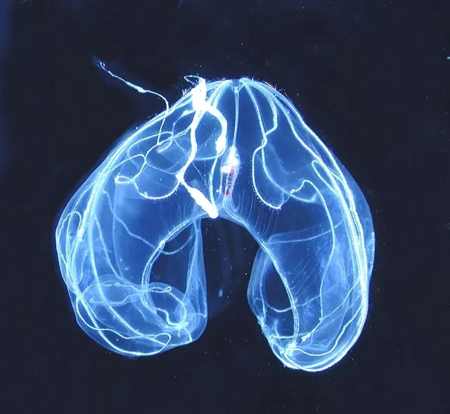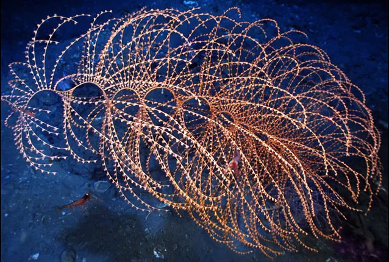

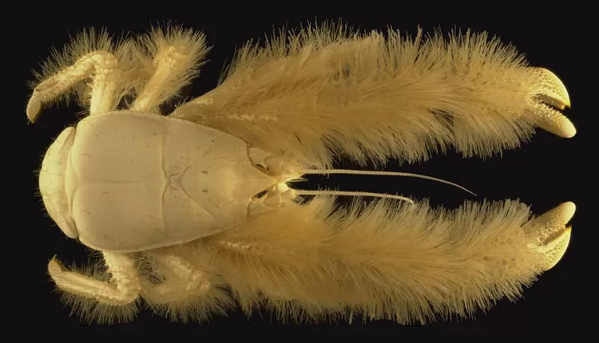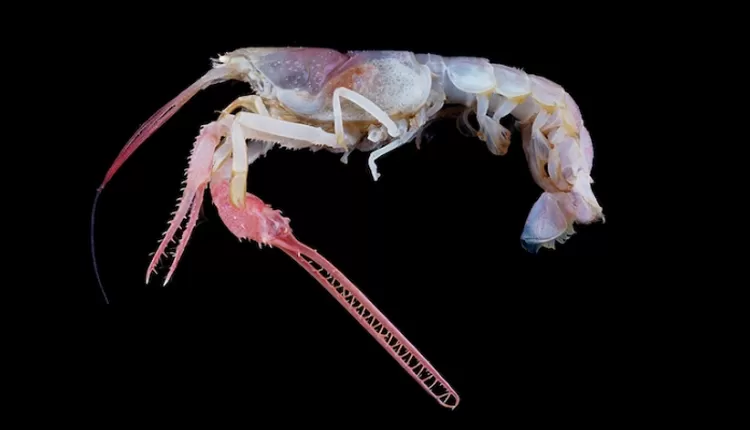
]
]
.c50[
.largetext[
- Creatures have adapted to a variety of environment.


- Nature finds *VERY* creative ways to survive in the world.


- What if we let our computer systems adapt themselves?
]
]]

.footnote[Image Credits: [Smithsonian Museum / Census of Marine Life](https://ocean.si.edu/ecosystems/census-marine-life)]

---

<!-- TODO: Yesterday we talked about the characteristics of life. We could say that evolution is one characteristic that is common to all life. Is it life that gives rise to evolution, or is it evolution that gives rise to life? Anyway, if we want to create artificial living being, it seems worthwhile to study artificial evolution. -->

# What if computers could evolve?

.largetext[
- Imagine a computer system that .greentext[can create copies of itself];
- Each copy is slightly modified, and .greentext[a little bit improved];


- The accumulation of these improvements over time would be unpredictable and suprising!

- What kind of system would evolve after many generations?
- What kind of problems this evolutionary system could solve?
]

---
layout: true

.sectionname[**Part 01.02:** Evolutionary Computation Example]

---

# Example: Evolution of Racing Cars

.center[
<iframe width="840" height="450" src="https://www.youtube.com/embed/uxourrlPlf8" title="YouTube video player" frameborder="0" allow="accelerometer; autoplay; clipboard-write; encrypted-media; gyroscope; picture-in-picture" allowfullscreen></iframe>]

[Link to the Video](https://www.youtube.com/watch?v=uxourrlPlf8)

---

# How do the cars evolve?

.cols[
.c80[
.largetext[
- Each car has a genome that defines
  - Shape and size of the body
  - Shape and size of wheels

- The cars that can go farther away have "children"

- The children can have small mutations
]]
.c20[
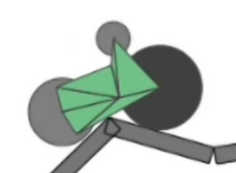
]
]

.largetext[Result: The cars evolve over time to reach the goal!]

.footnote[By the way, you can play with the cars in this link: https://rednuht.org/genetic_cars_2/]

---

# Another Evolutionary Example

.center[
.cols[

.c40[]

.c40[]

]

This robot evolves a body to throw a block as far away as possible.

We will learn more about this example on Thursday.]

---
layout: true

.sectionname[**Part 01.03**: A Recap on Natural Evolution]

---

# A Recap on Natural Evolution

.cols[
.c20[
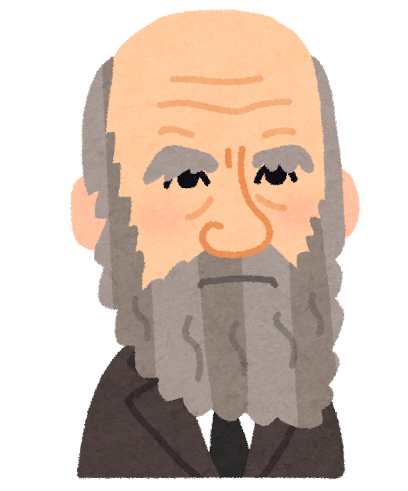
]
.c80[
.largetext[
- **Natural Evolution** is the mechanism that brought about the enormous variety of life in our world.

- Although the results of natural evolution are incredible, its core principles are relatively simple.

- Let's review the basics of natural evolution before we study how Artificial Evolution works.

- We can summarize the mechanism of evolution using three concepts: .greentext[Natural Selection, Genetic Inheritance, and Mutation.]
]
]
]

---

# Evolution Recap: Natural Selection

- .greentext[Creatures that are **well adapted** to the environment survive longer and have more children, increasing their population.]

- .redtext[Creatures that are **not well adapted** to the environment die out and have fewer children, reducing their population.]

.cols[
.c60[
In ancient England, it was easier for white moths to hide from predators in white tree trunks, so black moths were rare. After the industrial revolution, the black trunk of trees made it easier to hide for the black moths. (**Urban Legend?**)

.center[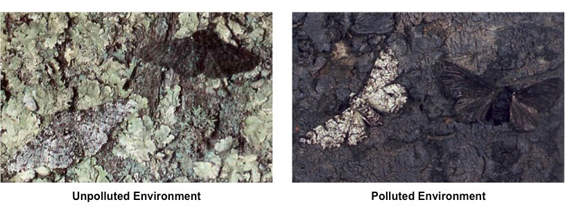]
]
.c40[
.center[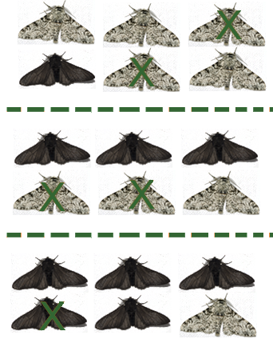]

]
]


---

# Evolution Recap: Genetic Inheritance

.cols[
.c70[
- Why does the population of well adapted creatures increase?
- Because children .greentext[inherit] the characteristics of their parents.

- The **genetic code** shared by offspring and parents is the way information about how to thrive in the environment is transmitted between generations.

- .redtext[Crossover] between parents can help gather useful information.

**Thought Experiment: What if no genomes?**
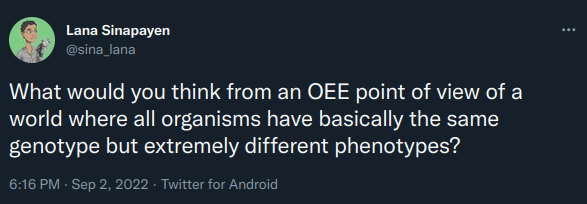
]
.c30[
.center[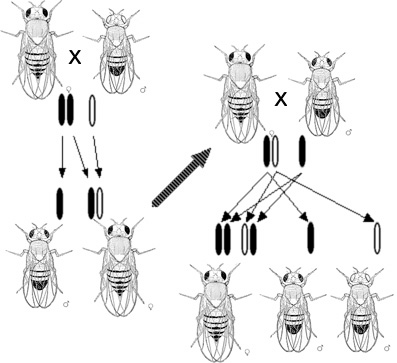]
]
]

---

# Evolution Recap: Mutation

.cols[
.c30[
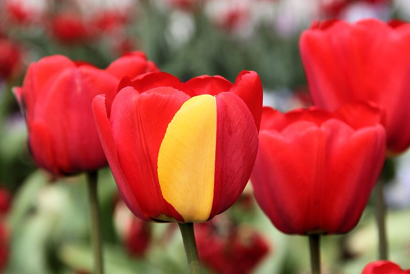
]
.c70[
.largetext[
- Why are creatures different?

- .greentext[Genetic Mutation] (solar radiation, cellular errors, viruses) causes changes in genes

- Beneficial changes (or neutral...) survive and multiply;

- Accumulated changes -> new species!
]
]
]

.boxyellow[
.boxlabel[Wait! There's more!]

There is much more in the process of natural evolution (epigenetics, environmental effects, etc), but this is enough for us to get started with evolutionary computation!
]

---
layout: true

.sectionname[**Part 01.04:** A Simple Evolutionary Algorithm]

---

# The Genetic Algorithm (GA)

Inspired by the Natural Evolution, we can design a simple computer program
that calculates/finds the solution to a problem.

This program is composed of the following steps:

.boxyellow[
```
1. Define a mathematical **Encoding** of a solution to the problem.

2. Generate an initial **Population** of random solutions to the problem, using this encoding.

3. **Evaluate** the quality of each solution in the population.

4. **Select** the solutions in the population with the highest quality.

5. Generate offspring of the selected solutions, using **Crossover** and **Mutation**

6. **Replace** the original population with the offspring population, and return to 3.
```
]

This describes the **Genetic Algorithm**, a traditional evolutionary computation technique.

---

# GA Example: Corridor Optimization

Consider the following toy problem as an example of how to design and apply a GA:

.boxyellow[
.boxlabel[The Corridor Optimization Problem]

- You want to automatically control which lamps are on or off in a corridor
- You want to turn on enough lamps to illuminate the entire corridor
- But to avoid wasting energy, you want to turn on the minimal number of lamps
- Given these conditions, find the optimal set of on and off lamps
]

.center[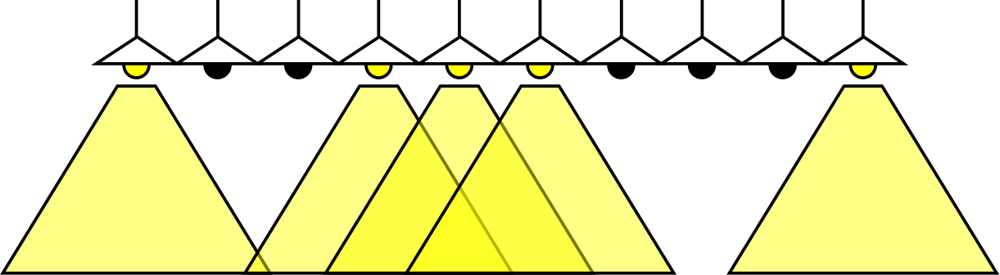]

How could you use GA to find an optimal solution to this problem?

---

# To design a GA program, we define three parts

.largetext[
1. **The Encoding:** How to represent a solution mathematically.

2. **The Fitness:** How to evaluate and select a solution.

3. **Genetic Operators:** How to generate new solutions.
]

Depending on how we define these three parts, we can have many variations of Evolutionary Computation.

---

# The Encoding

The encoding (or *genotype*) of a Genetic Algorithm is how we represent a solution to the problem in data form. This will be the **"Gene"** of our Evolutionary Computation program.

For this problem, we can imagine the following encoding:
- A solution is represented as an array of zeroes and ones
- a zero represents a lamp in the `off` position,
- an one represents a lamp in the `on` position.

Examples:

 Encoding: `1 0 0 1 1 1 0 0 0 1`

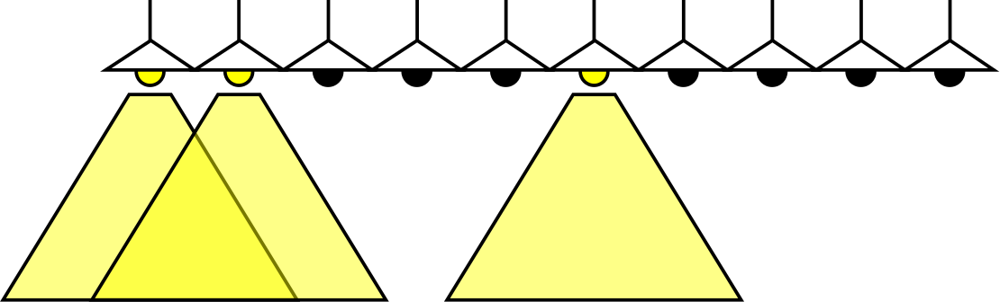 Encoding: `1 1 0 0 0 1 0 0 0 0`

---

# The Fitness

The Fitness (or *Fitness Function*) is a mathematical formula that calculates the quality of a solution.

For this problem, we can imagine the following Fitness Function:
- First we add the total area of the corridor that is illuminated by at least 1 lamp.
- Next we subtract the total number of lamps in the `on` position.

Examples:

 Encoding: `1 0 0 1 1 1 0 0 0 1`, Fitness: +9 -5 = +4

 Encoding: `1 1 0 0 0 1 0 0 0 0`, Fitness: +6 -3 = +3

The solutions with highest fitness function values are selected to multiply.

---

# Genetic Operators

The Genetic Operators (*Crossover*, *Mutation*) create new solutions from old ones. The old solutions were selected by their fitness score, so we expect the new solutions to be similar in quality to their parents.

.cols[
.col70[
- **Crossover**: The Genes of two parent solutions are mixed.

```
Parent 1 :  1 0 0 | 1 1 1 0 | 0 0 1
Parent 2 :  1 1 0 | 0 0 1 0 | 0 0 0
            ------|---------|------
Offspring:  1 0 0 | 0 0 1 0 | 0 0 1
```

- **Mutation**: A small change is made on the Gene of one solution.

```
                              *
Original:   1 0 0   0 0 1 0   0 0 1
Mutation:   1 0 0   0 0 1 0   1 0 1
                              *
```

]
.col30[
.center[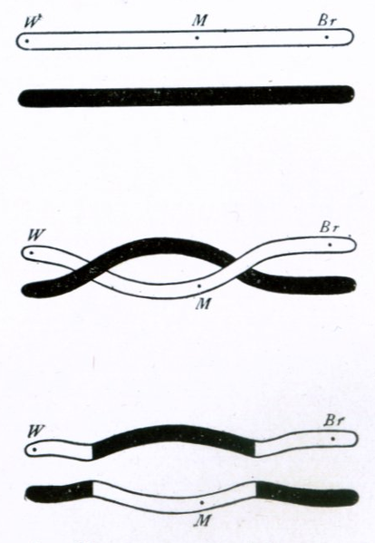]
]
]

---

# Putting Everything Together:

With the three parts we described, we can put together the Genetic Algorithm:
- Genetic encoding;
- Fitness function and Selection;
- Crossover and Mutation;

The implementation on a computer is not very hard (but we will not do coding during this course).

.boxyellow[
```
1. Define a mathematical **Encoding** of a solution to the problem.

2. Generate an initial **Population** of random solutions to the problem, using this encoding.

3. **Evaluate** the quality of each solution in the population.

4. **Select** the solutions in the population with the highest quality.

5. Generate offspring of the selected solutions, using **Crossover** and **Mutation**

6. **Replace** the original population with the offspring population, and return to 3.
```
]

The six steps above are repeated a fixed number of times, or until a good solution has been found.

---

layout: true

.sectionname[**Part 01.05**: Summary]

---

# Summary

.largetext[
- **Evolutionary Computation** is a family of techniques that use .greentext[natural evolution] as inspiration to make a computer system
that can improve itself.


.boxyellow[
.boxlabel[Discussion]

- How far do you think computers could improve through evolution?
- What about other technologies? What kinds of objects do you think it would be nice if they were able to evolve as well?

]

.right[Let's take a short break!]
]
---

layout: false
class: center, middle

# Part 02: Evolutionary Computation and Optimization

---
layout: true

.sectionname[**Part 02.01**: EvoComp and Optimization]

---

# Solving Hard Problems with EvoComp
- Evolutionary Computation can help us to solve problems that we
don't know the answer for.
  - We know what the final solution should do, but we don't know what it looks
  like
  - Just set a fitness function and go!

---

# Evolutionary Algorithm and Optimization

- Find the number that maximize some fitness function
- Applications: Design (Bullet train, Antenna, Underwater)

- *Optimization*

---
layout: true

.sectionname[**Part 02.02:** Evolutionary Optimization Examples]

---

# Evolutionary Algorithms for Optimization
- Example 1: Lunar landing problem

- Example 2: Travelling Salesman problem

- Message: Different problems, different implementations.

---
layout: true

.sectionname[**Part 02.03:** Issues in Evolutionary Optimization]

---

# Issues with Evolutionary Computation for Optimization
- The optimal solution is not guaranteed! (Good enough for hard problems, not so good for easy problems)
- It takes time (Parallel Evolutionary Algorithm)
- Needs to choose many parameters (Diversity and Island Model)
- Many parameters to choose (Exploration vs Exploitation)

- You usually want to use domain knowledge too!

---

# (Advanced) How to implement Evocomp -- Recommended Libraries.

---
layout: false
class: center, middle

# Part 03: Human in the Loop: Interactive Evolutionary Computation

---
layout: true

.sectionname[Part 03.01: Iteractive EvoComp]

---

# Interactive Evolutionary Computation
- Interactive Evolutionary Computation: Putting the human in the loop
- Evolutionary Algorithm for Room Layout Design
- Evolutionary Algorithm to reproduce a picture with rectangles
- "Breeding" Art
- "Evolution without an Objective" and Novelty Search

---
layout: false
class: center, middle

# Part 04: Extra topics in Evolutionary Computation

---
layout: true

.sectionname[**Part 04.01**: Extra Topics]

---

# Extra topics in Evolutionary Computation
- Evolutionary Computation and Artificial Life
- How Evolution can Surprise Us
- Open Ended Evolution
- From life to simulation to live (xenobots)
- (Advanced) Genetic Programming

---
layout: false
class: center, middle

# Part 05: Hands-on Practice

---
layout: true

.sectionname[Part 05.01: Hands-on EvoComp]

---

# Hands On Evolutionary Computation
- Fitness Landscape Explorer
- Box2D Evolver
- Art Breeder
- Soft Bot Evolver
