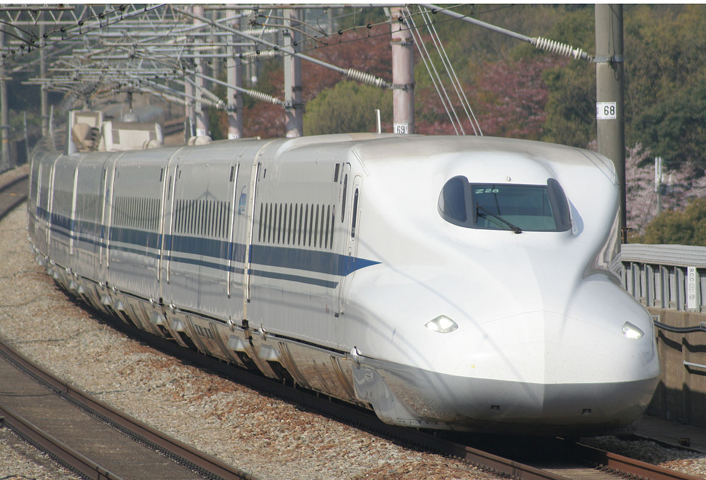
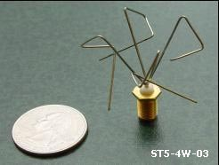
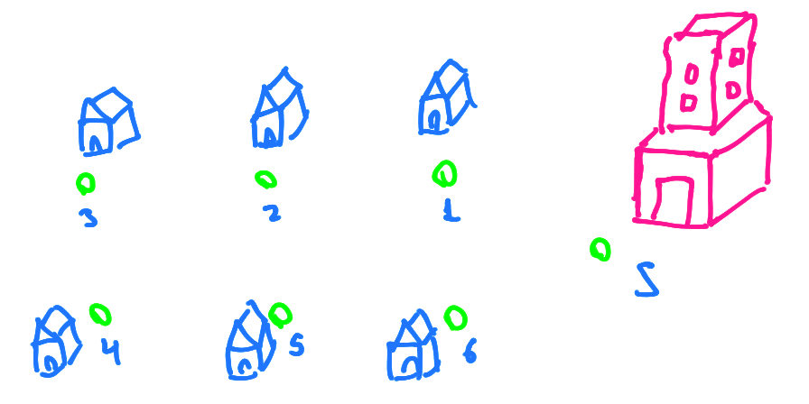
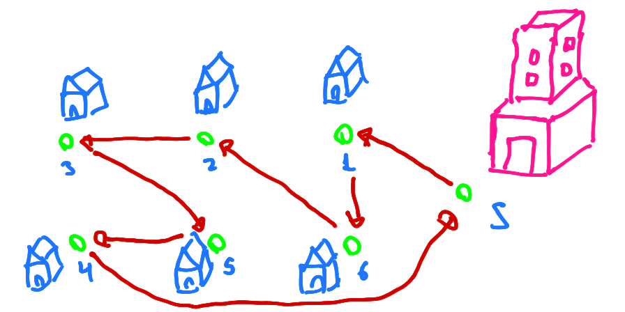
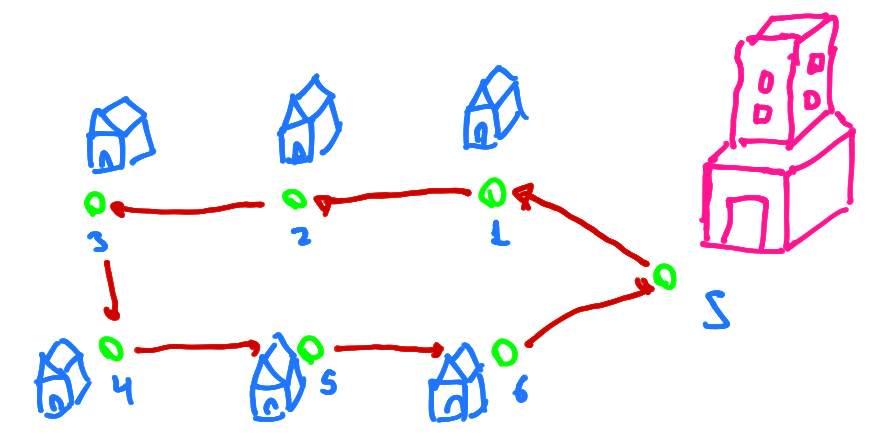

name: title
class: center, middle

# Introduction to Bioinspired Computation
## Lecture 02: Evolutionary Computation
Claus Aranha, University of Tsukuba

.cols[

.c40[]

.c40[]

]

---
name: toc

# Outline for Today:

## 01 - Basic Concepts of Evolutionary Computation;

## 02 - Applications of Evolutionary Computation;

## 03 - Human in the Loop: Interactive Evolutionary Computation

## 04 - Extra Topics in Evolutionary Computation;
- Research Issues, Artificial Life and Open Ended Evolution

## 05 - Hands-on Practice with Evolutionary Computation

---
layout: false
class: center, middle

# Part 01:

# Introduction to Evolutionary Computation

---
layout: true

.sectionname[**Part 01.01:** What is Evolutionary Computation?]

---

# Why Evolution?

.cols[
.c50[
.center[


]
]
.c50[
.largetext[
- Creatures have adapted to a variety of environment.


- Nature finds *VERY* creative ways to survive in the world.


- What if we let our computer systems adapt themselves?
]
]]

.footnote[Image Credits: [Smithsonian Museum / Census of Marine Life](https://ocean.si.edu/ecosystems/census-marine-life)]

---

<!-- TODO: Yesterday we talked about the characteristics of life. We could say that evolution is one characteristic that is common to all life. Is it life that gives rise to evolution, or is it evolution that gives rise to life? Anyway, if we want to create artificial living being, it seems worthwhile to study artificial evolution. -->

# What if computers could evolve?

.largetext[
- Imagine a computer system that .greentext[can create copies of itself];
- Each copy is slightly modified, and .greentext[a little bit improved];


- The accumulation of these improvements over time would be unpredictable and suprising!

- What kind of system would evolve after many generations?
- What kind of problems this evolutionary system could solve?
]

---
layout: true

.sectionname[**Part 01.02:** Evolutionary Computation Example]

---

# Example: Evolution of Racing Cars

.center[
<iframe width="840" height="450" src="https://www.youtube.com/embed/uxourrlPlf8" title="YouTube video player" frameborder="0" allow="accelerometer; autoplay; clipboard-write; encrypted-media; gyroscope; picture-in-picture" allowfullscreen></iframe>]

[Link to the Video](https://www.youtube.com/watch?v=uxourrlPlf8)

---

# How do the cars evolve?

.cols[
.c80[
.largetext[
- Each car has a genome that defines
  - Shape and size of the body
  - Shape and size of wheels

- The cars that can go farther away have "children"

- The children can have small mutations
]]
.c20[

]
]

.largetext[Result: The cars evolve over time to reach the goal!]

.footnote[By the way, you can play with the cars in this link: https://rednuht.org/genetic_cars_2/]

---

# Another Evolutionary Example

.center[
.cols[

.c40[]

.c40[]

]

This robot evolves a body to throw a block as far away as possible.

We will learn more about this example on Thursday.]

---
layout: true

.sectionname[**Part 01.03**: A Recap on Natural Evolution]

---

# A Recap on Natural Evolution

.cols[
.c20[

]
.c80[
.largetext[
- **Natural Evolution** is the mechanism that brought about the enormous variety of life in our world.

- Although the results of natural evolution are incredible, its core principles are relatively simple.

- Let's review the basics of natural evolution before we study how Artificial Evolution works.

- We can summarize the mechanism of evolution using three concepts: .greentext[Natural Selection, Genetic Inheritance, and Mutation.]
]
]
]

---

# Evolution Recap: Natural Selection

- .greentext[Creatures that are **well adapted** to the environment survive longer and have more children, increasing their population.]

- .redtext[Creatures that are **not well adapted** to the environment die out and have fewer children, reducing their population.]

.cols[
.c60[
In ancient England, it was easier for white moths to hide from predators in white tree trunks, so black moths were rare. After the industrial revolution, the black trunk of trees made it easier to hide for the black moths. (**Urban Legend?**)

.center[]
]
.c40[
.center[]

]
]


---

# Evolution Recap: Genetic Inheritance

.cols[
.c70[
- Why does the population of well adapted creatures increase?
- Because children .greentext[inherit] the characteristics of their parents.

- The **genetic code** shared by offspring and parents is the way information about how to thrive in the environment is transmitted between generations.

- .redtext[Crossover] between parents can help gather useful information.

**Thought Experiment: What if no genomes?**

]
.c30[
.center[]
]
]

---

# Evolution Recap: Mutation

.cols[
.c30[

]
.c70[
.largetext[
- Why are creatures different?

- .greentext[Genetic Mutation] (solar radiation, cellular errors, viruses) causes changes in genes

- Beneficial changes (or neutral...) survive and multiply;

- Accumulated changes -> new species!
]
]
]

.boxyellow[
.boxlabel[Wait! There's more!]

There is much more in the process of natural evolution (epigenetics, environmental effects, etc), but this is enough for us to get started with evolutionary computation!
]

---
layout: true

.sectionname[**Part 01.04:** A Simple Evolutionary Algorithm]

---

# The Genetic Algorithm (GA)

Inspired by the Natural Evolution, we can design a simple computer program
that calculates/finds the solution to a problem.

This program is composed of the following steps:

.boxyellow[
```
1. Define a mathematical **Encoding** of a solution to the problem.

2. Generate an initial **Population** of random solutions to the problem, using this encoding.

3. **Evaluate** the quality of each solution in the population.

4. **Select** the solutions in the population with the highest quality.

5. Generate offspring of the selected solutions, using **Crossover** and **Mutation**

6. **Replace** the original population with the offspring population, and return to 3.
```
]

This describes the **Genetic Algorithm**, a traditional evolutionary computation technique.

---

# GA Example: Corridor Optimization

Consider the following toy problem as an example of how to design and apply a GA:

.boxyellow[
.boxlabel[The Corridor Optimization Problem]

- You want to automatically control which lamps are on or off in a corridor
- You want to turn on enough lamps to illuminate the entire corridor
- But to avoid wasting energy, you want to turn on the minimal number of lamps
- Given these conditions, find the optimal set of on and off lamps
]

.center[]

How could you use GA to find an optimal solution to this problem?

---

# To design a GA program, we define three parts

.largetext[
1. **The Encoding:** How to represent a solution mathematically.

2. **The Fitness:** How to evaluate and select a solution.

3. **Genetic Operators:** How to generate new solutions.
]

Depending on how we define these three parts, we can have many variations of Evolutionary Computation.

---

# The Encoding

The encoding (or *genotype*) of a Genetic Algorithm is how we represent a solution to the problem in data form. This will be the **"Gene"** of our Evolutionary Computation program.

For this problem, we can imagine the following encoding:
- A solution is represented as an array of zeroes and ones
- a zero represents a lamp in the `off` position,
- an one represents a lamp in the `on` position.

Examples:

 Encoding: `1 0 0 1 1 1 0 0 0 1`

 Encoding: `1 1 0 0 0 1 0 0 0 0`

---

# The Fitness

The Fitness (or *Fitness Function*) is a mathematical formula that calculates the quality of a solution.

For this problem, we can imagine the following Fitness Function:
- First we add the total area of the corridor that is illuminated by at least 1 lamp.
- Next we subtract the total number of lamps in the `on` position.

Examples:

 Encoding: `1 0 0 1 1 1 0 0 0 1`, Fitness: +9 -5 = +4

 Encoding: `1 1 0 0 0 1 0 0 0 0`, Fitness: +6 -3 = +3

The solutions with highest fitness function values are selected to multiply.

---

# Genetic Operators

The Genetic Operators (*Crossover*, *Mutation*) create new solutions from old ones. The old solutions were selected by their fitness score, so we expect the new solutions to be similar in quality to their parents.

.cols[
.col70[
- **Crossover**: The Genes of two parent solutions are mixed.

```
Parent 1 :  1 0 0 | 1 1 1 0 | 0 0 1
Parent 2 :  1 1 0 | 0 0 1 0 | 0 0 0
            ------|---------|------
Offspring:  1 0 0 | 0 0 1 0 | 0 0 1
```

- **Mutation**: A small change is made on the Gene of one solution.

```
                              *
Original:   1 0 0   0 0 1 0   0 0 1
Mutation:   1 0 0   0 0 1 0   1 0 1
                              *
```

]
.col30[
.center[]
]
]

---

# Putting Everything Together:

With the three parts we described, we can put together the Genetic Algorithm:
- Genetic encoding;
- Fitness function and Selection;
- Crossover and Mutation;

The implementation on a computer is not very hard (but we will not do coding during this course).

.boxyellow[
```
1. Define a mathematical **Encoding** of a solution to the problem.

2. Generate an initial **Population** of random solutions to the problem, using this encoding.

3. **Evaluate** the quality of each solution in the population.

4. **Select** the solutions in the population with the highest quality.

5. Generate offspring of the selected solutions, using **Crossover** and **Mutation**

6. **Replace** the original population with the offspring population, and return to 3.
```
]

The six steps above are repeated a fixed number of times, or until a good solution has been found.

---

layout: true

.sectionname[**Part 01.05**: Summary]

---

# Summary

.largetext[
- **Evolutionary Computation** is a family of techniques that use .greentext[natural evolution] as inspiration to make a computer system
that can improve itself.


.boxyellow[
.boxlabel[Discussion]

- How far do you think computers could improve through evolution?
- What about other technologies? What kinds of objects do you think it would be nice if they were able to evolve as well?

]

.right[Let's take a short break!]
]
---

layout: false
class: center, middle

# Part 02: Applications of Evolutionary Computation

---
layout: true

.sectionname[**Part 02.01**: Evocomp and Optimization]

---

# Where do we use Evolutionary Computation?

.largetext[
.greentext[Genetic Algorithms] were first proposed in the 80ies. Since then, we
have found that GA is very useful to solve .greentext[Optimization Problems].

**Optimization Problems**:

- We want to find a set of values that form a **solution**;
- A good solution maximizes a given **quality criteria**;
- Sometimes, there are **constraint criteria** to the solutions;

We will see a few examples of optimization problems in the following slides.
Many industrial problems can be described as optimization problems.
]

---

# When are GAs useful in Optimization?

.largetext[
- It is easy to test if a solution is good or bad;
- It is hard to calculate how to improve an existing solution;
- We are interested in "**Creative**" solutions to the problem;
]

.center[
.cols[
.c50[
GA finds a Design for *Shinkansen* nose cones;



]
.c50[
GA finds a Design for satellite antennas;


]
]]

---
layout: true

.sectionname[**Part 02.02:** Examples of Applications]

---

# The Traveling Salesman Problem (TSP)

.largetext[
The Traveling Salesman Problem is a classical example of an optimization problem:

> **Find the shortest route that visit all points in a map**.

The TSP has obvious applications for navigation, trains, delivery... but it is also useful for circuit design and many other applications!
]

.center[
.cols[
.c30[

]
.c30[

]
.c30[

]
]]

---

# TSP and Genetic Algorithms

.largetext[
The TSP is a good match to be solved using Genetic Algorithms:

- It is easy to measure if a solution is good or bad.  
(Just measure the length)

- It is hard to improve an existing solution.

How can we create a GA to solve the TSP?
]


.boxyellow[
.boxlabel[The NP-Complete Problem Class]

In Computer Science, the TSP is part of what is called an "NP-Complete"
problem. The theoretical definition is not in the scope of this material,
but it indicates a set of problems that proved to be difficult (for current
computers), and of important theoretical value.
]

---

# Solving the TSP using GA: Genetic Encoding

.largetext[
As in the *Corridor* example, a GA needs: An Encoding, A fitness function, and crossover / mutation.

A solution can be represented as a list of numbers. Each number indicates **The next city to visit, out of all remaining cities**.
]

.cols[
.c50[
```
            6 5 4 3 2 1
Solution 1: 1 5 1 1 2 1
```

]
.c50[
```
            6 5 4 3 2 1   
Solution 2: 1 1 1 1 1 1
```

]
]

---

# Solving the TSP using GA: Fitness Function

.largetext[
As in the *Corridor* example, a GA needs: An Encoding, A fitness function, and crossover / mutation.

The fitness function is **The total distance of the route**.
]

.cols[
.c50[
```
Solution 1: 1     5   1     1   2     1
Fitness:    1.4 + 1 + 1.4 + 1 + 1.4 + 1 + 3
```

]
.c50[
```
Solution 1: 1     1   1   1   1   1
Fitness:    1.4 + 1 + 1 + 1 + 1 + 1 + 1.4
```

]
]

---

# Solving the TSP using GA: Fitness Function

.largetext[
As in the *Corridor* example, a GA needs: An Encoding, A fitness function, and crossover / mutation.

The mutation and crossover can be programmed the same as in the Corridor Example:

- **Mutation**: Replace one number in the Genome with another valid number
- **Crossover**: Choose two parents, and switch part of their genome
]

---

# GA Research Example: Underground Reservoir Optimization
- Problem Description: Why this problem is important
- How to solve it using GA
  - Parameter Optimization
  - Challenge: Multi-Objective Optimization
  - How to solve MOP using GA: Decomposition
- Research Results

---
# GA Research Example: Reproducing Images

https://chriscummins.cc/s/genetics/#

---
layout: true

.sectionname[**Part 02.03:** Research Issues in Evolutionary Optimization]

---

# Issues with Evolutionary Computation for Optimization
- GA is very good, but it has some open issues
- The optimal solution is not guaranteed! (Good enough for hard problems, not so good for easy problems)
- It takes time (Parallel Evolutionary Algorithm)
- Needs to choose many parameters (Diversity and Island Model)
- Many parameters to choose (Exploration vs Exploitation)
- You usually want to use domain knowledge too!

---

# How to implement Evocomp -- Recommended Libraries.
- Self-Implementation: Actually not that hard!
- Python: DEAP
- Java: ECJ

---

# Discussion Time:
- What kind of problems would you like to solve using Genetic Algorihtms?
- How would you describe that problem in a way that a GA can solve it?
  - Remember: Fitness Function, Representation, Crossover

---
layout: false
class: center, middle

# Part 03: Human in the Loop: Interactive Evolutionary Computation

---
layout: true

.sectionname[Part 03.01: Iteractive EvoComp]

---

# Interactive Evolutionary Computation

---
# Interactive Evolutionary Computation Example: Pic Breeder
- A quick look: https://nbenko1.github.io/#/
- How it works

---
# Novelty Search: Evolution without an Objective
- Interesting discussion: Going straight to the desired image does not work
- Novelty guided evolution

---
# Research Example:
- Evolutionary Algorithm for Room Layout Design

---
# Issues in Interactive Evolutionary Computation
- How to not tire the human (Evolution is slow!)
  - Collaboration between human fitness and computer fitness
  - Several levels of evolution
- How to use subjective evaluation

---
layout: false
class: center, middle

# Part 04: Extra topics in Evolutionary Computation

---
# Extra topics in Evolutionary Computation

---
layout: true

.sectionname[**Part 04.01**: How Evolution Can Surprise Us]

---
# How Evolution can Surprise us
- Traditional story about surprising evo and sine wave
- Surprising Evolution Paper
- Why evolution does this? Defining a good fitness function and "cheating"
- This makes evolutionary computation fun.

---
exclude: true

# From Life to Simulation, Back to Life
(xenobots)

# Genetic Programming

- What if we could evolve *Programs*
- Self-reproducing programs
- Problems with the halting problem.

---

# Open Ended Evolution: The final Frontier
- Current Evolutionary Algorithms are usually *Optimization* Algorithms
- EC can be used to find the best car, best route, best x
- But natural evolution can find a huge VARIETY of Creatures
- This is OEE. Can we create OEE with EC? What is necessary to achieve OEE?
- Environment? Computer Power? Representativeness?

---
layout: false
class: center, middle

# Part 05: Hands-on Practice

---
layout: true

.sectionname[Part 05.01: Hands-on EvoComp]

---

# Hands On Evolutionary Computation
## Fitness Landscape Explorer:
- https://adaptive.land/
- https://adaptive.land/coevolution.html

Study what makes Evolution work or not work.

## Car Evolution
- https://rednuht.org/genetic_cars_2/

Try different parameters for evolution.
You can evolve one car against others.

## Human Interaction Art Breeder
- Pic Breeder: https://nbenko1.github.io/#/

Evolve interesting images. What other sort of art would be interesting to evolve?

## Reproducing Images
https://chriscummins.cc/s/genetics/#
