name: title
class: center, middle

# Introduction to Bioinspired Computation
## Lecture 02: Evolutionary Computation
Claus Aranha, University of Tsukuba

.cols[

.c40[]

.c40[]

]

---
name: toc

# Outline for Today:

## 01 - Basic Concepts of Evolutionary Computation;

## 02 - Applications of Evolutionary Computation;

## 03 - Human in the Loop: Interactive Evolutionary Computation

## 04 - Extra Topics in Evolutionary Computation;
- Research Issues, Artificial Life and Open Ended Evolution

## 05 - Hands-on Practice with Evolutionary Computation

---
layout: false
class: center, middle

# Part 01:

# Introduction to Evolutionary Computation

---
layout: true

.sectionname[**Part 01.01:** What is Evolutionary Computation?]

---

# Why Evolution?

.cols[
.c50[
.center[


]
]
.c50[
.largetext[
- Creatures have adapted to a variety of environment.


- Nature finds *VERY* creative ways to survive in the world.


- What if we let our computer systems adapt themselves?
]
]]

.footnote[Image Credits: [Smithsonian Museum / Census of Marine Life](https://ocean.si.edu/ecosystems/census-marine-life)]

---

<!-- TODO: Yesterday we talked about the characteristics of life. We could say that evolution is one characteristic that is common to all life. Is it life that gives rise to evolution, or is it evolution that gives rise to life? Anyway, if we want to create artificial living being, it seems worthwhile to study artificial evolution. -->

# What if computers could evolve?

.largetext[
- Imagine a computer system that .greentext[can create copies of itself];
- Each copy is slightly modified, and .greentext[a little bit improved];


- The accumulation of these improvements over time would be unpredictable and suprising!

- What kind of system would evolve after many generations?
- What kind of problems this evolutionary system could solve?
]

---
layout: true

.sectionname[**Part 01.02:** Evolutionary Computation Example]

---

# Example: Evolution of Racing Cars

.center[
<iframe width="840" height="450" src="https://www.youtube.com/embed/uxourrlPlf8" title="YouTube video player" frameborder="0" allow="accelerometer; autoplay; clipboard-write; encrypted-media; gyroscope; picture-in-picture" allowfullscreen></iframe>]

[Link to the Video](https://www.youtube.com/watch?v=uxourrlPlf8)

---

# How do the cars evolve?

.cols[
.c80[
.largetext[
- Each car has a genome that defines
  - Shape and size of the body
  - Shape and size of wheels

- The cars that can go farther away have "children"

- The children can have small mutations
]]
.c20[

]
]

.largetext[Result: The cars evolve over time to reach the goal!]

.footnote[By the way, you can play with the cars in this link: https://rednuht.org/genetic_cars_2/]

---

# Another Evolutionary Example

.center[
.cols[

.c40[]

.c40[]

]

This robot evolves a body to throw a block as far away as possible.

We will learn more about this example on Thursday.]

---
layout: true

.sectionname[**Part 01.03**: A Recap on Natural Evolution]

---

# A Recap on Natural Evolution

.cols[
.c20[

]
.c80[
.largetext[
- **Natural Evolution** is the mechanism that brought about the enormous variety of life in our world.

- Although the results of natural evolution are incredible, its core principles are relatively simple.

- Let's review the basics of natural evolution before we study how Artificial Evolution works.

- We can summarize the mechanism of evolution using three concepts: .greentext[Natural Selection, Genetic Inheritance, and Mutation.]
]
]
]

---

# Evolution Recap: Natural Selection

- .greentext[Creatures that are **well adapted** to the environment survive longer and have more children, increasing their population.]

- .redtext[Creatures that are **not well adapted** to the environment die out and have fewer children, reducing their population.]

.cols[
.c60[
In ancient England, it was easier for white moths to hide from predators in white tree trunks, so black moths were rare. After the industrial revolution, the black trunk of trees made it easier to hide for the black moths. (**Urban Legend?**)

.center[]
]
.c40[
.center[]

]
]


---

# Evolution Recap: Genetic Inheritance

.cols[
.c70[
- Why does the population of well adapted creatures increase?
- Because children .greentext[inherit] the characteristics of their parents.

- The **genetic code** shared by offspring and parents is the way information about how to thrive in the environment is transmitted between generations.

- .redtext[Crossover] between parents can help gather useful information.

**Thought Experiment: What if no genomes?**

]
.c30[
.center[]
]
]

---

# Evolution Recap: Mutation

.cols[
.c30[

]
.c70[
.largetext[
- Why are creatures different?

- .greentext[Genetic Mutation] (solar radiation, cellular errors, viruses) causes changes in genes

- Beneficial changes (or neutral...) survive and multiply;

- Accumulated changes -> new species!
]
]
]

.boxyellow[
.boxlabel[Wait! There's more!]

There is much more in the process of natural evolution (epigenetics, environmental effects, etc), but this is enough for us to get started with evolutionary computation!
]

---
layout: true

.sectionname[**Part 01.04:** A Simple Evolutionary Algorithm]

---

# The Genetic Algorithm (GA)

Inspired by the Natural Evolution, we can design a simple computer program
that calculates/finds the solution to a problem.

This program is composed of the following steps:

.boxyellow[
```
1. Define a mathematical **Encoding** of a solution to the problem.

2. Generate an initial **Population** of random solutions to the problem, using this encoding.

3. **Evaluate** the quality of each solution in the population.

4. **Select** the solutions in the population with the highest quality.

5. Generate offspring of the selected solutions, using **Crossover** and **Mutation**

6. **Replace** the original population with the offspring population, and return to 3.
```
]

This describes the **Genetic Algorithm**, a traditional evolutionary computation technique.

---

# GA Example: Corridor Optimization

Consider the following toy problem as an example of how to design and apply a GA:

.boxyellow[
.boxlabel[The Corridor Optimization Problem]

- You want to automatically control which lamps are on or off in a corridor
- You want to turn on enough lamps to illuminate the entire corridor
- But to avoid wasting energy, you want to turn on the minimal number of lamps
- Given these conditions, find the optimal set of on and off lamps
]

.center[]

How could you use GA to find an optimal solution to this problem?

---

# To design a GA program, we define three parts

.largetext[
1. **The Encoding:** How to represent a solution mathematically.

2. **The Fitness:** How to evaluate and select a solution.

3. **Genetic Operators:** How to generate new solutions.
]

Depending on how we define these three parts, we can have many variations of Evolutionary Computation.

---

# The Encoding

The encoding (or *genotype*) of a Genetic Algorithm is how we represent a solution to the problem in data form. This will be the **"Gene"** of our Evolutionary Computation program.

For this problem, we can imagine the following encoding:
- A solution is represented as an array of zeroes and ones
- a zero represents a lamp in the `off` position,
- an one represents a lamp in the `on` position.

Examples:

 Encoding: `1 0 0 1 1 1 0 0 0 1`

 Encoding: `1 1 0 0 0 1 0 0 0 0`

---

# The Fitness

The Fitness (or *Fitness Function*) is a mathematical formula that calculates the quality of a solution.

For this problem, we can imagine the following Fitness Function:
- First we add the total area of the corridor that is illuminated by at least 1 lamp.
- Next we subtract the total number of lamps in the `on` position.

Examples:

 Encoding: `1 0 0 1 1 1 0 0 0 1`, Fitness: +9 -5 = +4

 Encoding: `1 1 0 0 0 1 0 0 0 0`, Fitness: +6 -3 = +3

The solutions with highest fitness function values are selected to multiply.

---

# Genetic Operators

The Genetic Operators (*Crossover*, *Mutation*) create new solutions from old ones. The old solutions were selected by their fitness score, so we expect the new solutions to be similar in quality to their parents.

.cols[
.col70[
- **Crossover**: The Genes of two parent solutions are mixed.

```
Parent 1 :  1 0 0 | 1 1 1 0 | 0 0 1
Parent 2 :  1 1 0 | 0 0 1 0 | 0 0 0
            ------|---------|------
Offspring:  1 0 0 | 0 0 1 0 | 0 0 1
```

- **Mutation**: A small change is made on the Gene of one solution.

```
                              *
Original:   1 0 0   0 0 1 0   0 0 1
Mutation:   1 0 0   0 0 1 0   1 0 1
                              *
```

]
.col30[
.center[]
]
]

---

# Putting Everything Together:

With the three parts we described, we can put together the Genetic Algorithm:
- Genetic encoding;
- Fitness function and Selection;
- Crossover and Mutation;

The implementation on a computer is not very hard (but we will not do coding during this course).

.boxyellow[
```
1. Define a mathematical **Encoding** of a solution to the problem.

2. Generate an initial **Population** of random solutions to the problem, using this encoding.

3. **Evaluate** the quality of each solution in the population.

4. **Select** the solutions in the population with the highest quality.

5. Generate offspring of the selected solutions, using **Crossover** and **Mutation**

6. **Replace** the original population with the offspring population, and return to 3.
```
]

The six steps above are repeated a fixed number of times, or until a good solution has been found.

---

layout: true

.sectionname[**Part 01.05**: Summary]

---

# Summary

.largetext[
- **Evolutionary Computation** is a family of techniques that use .greentext[natural evolution] as inspiration to make a computer system
that can improve itself.


.boxyellow[
.boxlabel[Discussion]

- How far do you think computers could improve through evolution?
- What about other technologies? What kinds of objects do you think it would be nice if they were able to evolve as well?

]

.right[Let's take a short break!]
]
---

layout: false
class: center, middle

# Part 02: Applications of Evolutionary Computation

---
layout: true

.sectionname[**Part 02.01**: Evocomp and Optimization]

---

# Where do we use Evolutionary Computation?

.largetext[
.greentext[Genetic Algorithms] were first proposed in the 80ies. Since then, we
have found that GA is very useful to solve .greentext[Optimization Problems].

**Optimization Problems**:

- We want to find a set of values that form a **solution**;
- A good solution maximizes a given **quality criteria**;
- Sometimes, there are **constraint criteria** to the solutions;

We will see a few examples of optimization problems in the following slides.
Many industrial problems can be described as optimization problems.
]

---

# When are GAs useful in Optimization?

.largetext[
- It is easy to test if a solution is good or bad;
- It is hard to calculate how to improve an existing solution;
- We are interested in "**Creative**" solutions to the problem;
]

.center[
.cols[
.c50[
GA finds a Design for *Shinkansen* nose cones;


]
.c50[
GA finds a Design for satellite antennas;


]
]]

---
layout: true

.sectionname[**Part 02.02:** Examples of Applications]

---

# The Traveling Salesman Problem (TSP)

.largetext[
The Traveling Salesman Problem is a classical example of an optimization problem:

> **Find the shortest route that visit all points in a map**.

The TSP has obvious applications for navigation, trains, delivery... but it is also useful for circuit design and many other applications!
]

.center[
.cols[
.c30[

]
.c30[

]
.c30[

]
]]

---

# TSP and Genetic Algorithms

.largetext[
The TSP is a good match to be solved using Genetic Algorithms:

- It is easy to measure if a solution is good or bad.  
(Just measure the length)

- It is hard to improve an existing solution.

How can we create a GA to solve the TSP?
]


.boxyellow[
.boxlabel[The NP-Complete Problem Class]

In Computer Science, the TSP is part of what is called an "NP-Complete"
problem. The theoretical definition is not in the scope of this material,
but it indicates a set of problems that proved to be difficult (for current
computers), and of important theoretical value.
]

---

# Solving the TSP using GA: Genetic Encoding

.largetext[
As in the *Corridor* example, a GA needs: An Encoding, A fitness function, and crossover / mutation.

A solution can be represented as a list of numbers. Each number indicates **The next city to visit, out of all remaining cities**.
]

.cols[
.c50[
```
            6 5 4 3 2 1
Solution 1: 1 5 1 1 2 1
```

]
.c50[
```
            6 5 4 3 2 1   
Solution 2: 1 1 1 1 1 1
```

]
]

---

# Solving the TSP using GA: Fitness Function

.largetext[
As in the *Corridor* example, a GA needs: An Encoding, A fitness function, and crossover / mutation.

The fitness function is **The total distance of the route**.
]

.cols[
.c50[
```
Solution 1: 1     5   1     1   2     1
Fitness:    1.4 + 1 + 1.4 + 1 + 1.4 + 1 + 3
```

]
.c50[
```
Solution 1: 1     1   1   1   1   1
Fitness:    1.4 + 1 + 1 + 1 + 1 + 1 + 1.4
```

]
]

---

# Solving the TSP using GA: Fitness Function

.largetext[
As in the *Corridor* example, a GA needs: An Encoding, A fitness function, and crossover / mutation.

The mutation and crossover can be programmed the same as in the Corridor Example:

- **Mutation**: Replace one number in the Genome with another valid number
- **Crossover**: Choose two parents, and switch part of their genome
]

---

# Model Parameter Optimization Problem

.largetext[
A computational **Model** is a tool used in several applications for prediction
and decision making. For example, we can use cloud movements for weather forecast.

Many models depend on **parameters** for their correct functioning. For example:
- Weather forecast model depends on the air composition and speed at different locations.
- A seismic model (used for prediction of geothermal) depends on the permeability and porosity of rock layers.

GA can be used to find optimal values for these parameters.
]

---

# Underground Reservoir Model Optimization

.cols[
.c70[
- Underground Reservoirs include water, gas and oil Reservoirs, as
well as Carbon Capture Reservoirs.

- Well tuned models are important for planning and decision making.

- Direct observation is impossible, so the model parameters are tuned
based on partial data observed from the surface (wells, seismic stations);

- Problem Objective: Find the computational model that reproduce the surface
data best!

**Related Research**
- Aranha, Tanabe, Chassagne and Fukunaga, 2015
- Chassagne, Aranha, 2020
- He, Aranha, Hallam, Chassagne, 2022
]
.c30[
.center[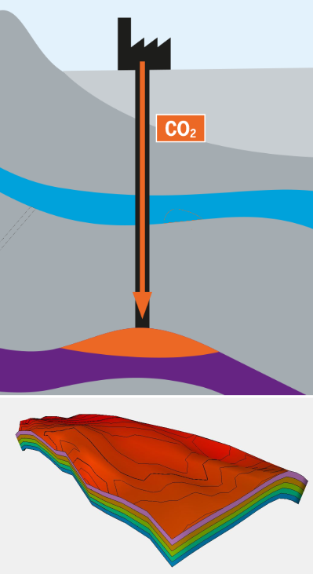]
]
]

---

# Model Optimization Issue: Well, actually...

.cols[
.c50[
.largetext[
A key characteristic of this problem is that the optimization of underground reservoir models is based on .greentext[data observed from several wells].

Each well is represented as a fitness function. However, in general, computational models .redtext[cannot fit different wells at the same time!]
]
]
.c50[
.center[
PUNQ Underground Model,  
with several output wells

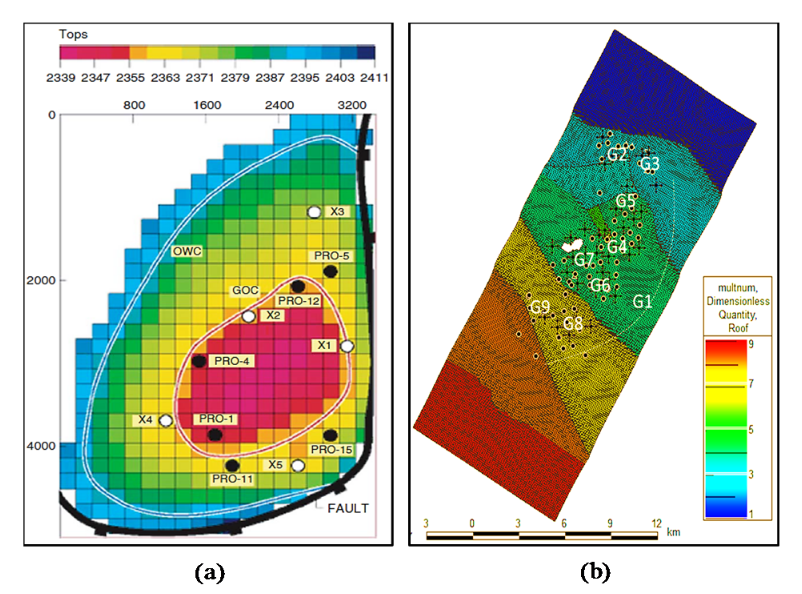]
]
]


.largetext[How can we solve this fitness function conflict?]

---
# Optimization of Multi-Objective Problems

.largetext[In many cases, optimization problems have **several objectives** that cannot be all satisfied at the same time. We call this situation a  
.greentext[Multi-Objective Problem (MOP)].]

.cols[
.c50[
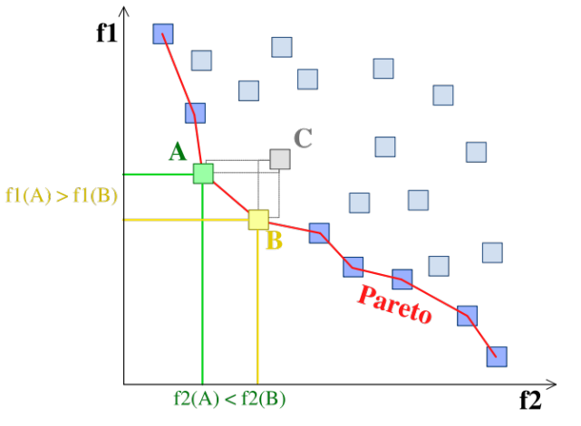
]
.c50[
**Non-dominance**: We say that two solutions in a MOP are "non-dominated", if each solution is better than the other one in at least one objective.

When solving an MOP, the objective of the algorithm changes from .redtext["find the best solution"] to .greentext["find the set of optimal non-dominated solutions"].
]
]

---
# Optimization of MOPs: NSGA II

.largetext["Nondominated Sorting Genetic Algorithm II" (NSGA2) is a standard algorithm for solving multiobjective optimization problems.

NSGA 2 replaces the traditional fitness function with a "nondominated rank".
]

.center[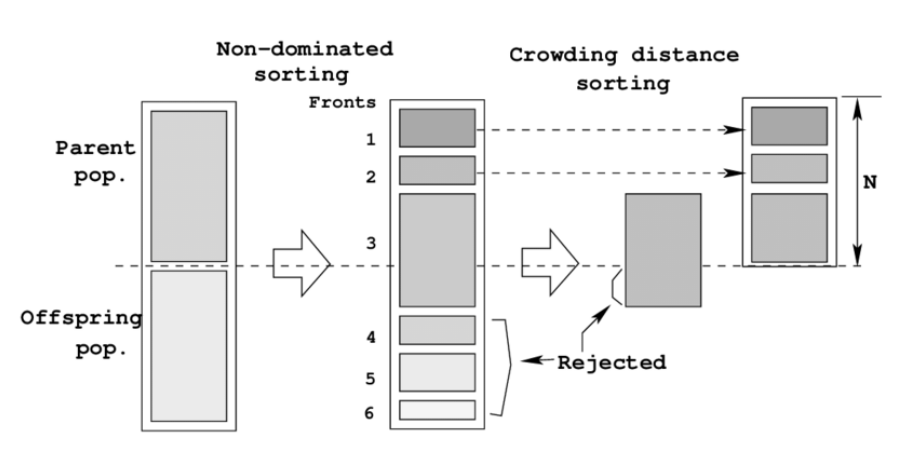]

---
# GA for Art Generation

.center[
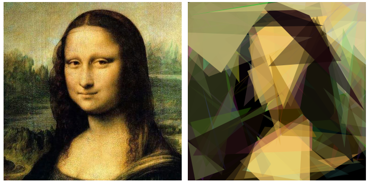
]

.largetext[
With a little bit of creativity, we can create interesting artworks using Genetic Algorithms.
]


You can test this demo at https://chriscummins.cc/s/genetics/#

---
# GA for Art Generation

.cols[
.c50[
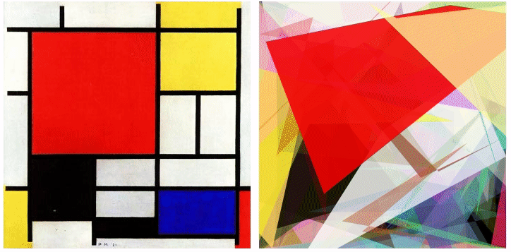

]
.c50[
.largetext[
How does it work?
- Each image is made of several polygons;
- **Genome**: the x,y position of each polygon vertex;
- **Fitness**: the distance between the GA image and the original;
- **Mutation**: Same as usual!
]
]
]

.largetext[
**GA For Art**: GA follows the fitness function. Carefully chosen function can generate other creative images!
]

---
layout: true

.sectionname[**Part 02.03:** Discussion Topics]

---

# Three Open Issues with GA for Optimization

.cols[
.c70[
.largetext[
1-  The optimal solution is not guaranteed:
]

GA can find very good solutions, but is not guaranteed to find the Optimal solution to a problem (.greentext[Good Enough])

This happens because GA is a "search-based" optimization method: It tries several solutions, but not all of them. It might miss the location of the optimal solution.

What can we do about this?
- **Increase diversity**: If we can find the "region" of the optimal solution, it is more likely that we can find it.
- **Restart Strategy**: When GA starts to repeat solutions, we re-start it with a new initial population.
- **Consider the problem carefully**: Is the Optimal solution really necessary?

]
.c30[

]
]

---

# Three Open Issues with GA for Optimization

.cols[
.c70[
.largetext[
2- GA takes a lot of time;
]

The evolutionary loop of a GA can take a lot of time. Compared with mathematical optimization algorithms such as hill climbing and integer programming, GA takes an order of magnitude more iterations to find a solution.

What can we do about this?
- **Parallelism**: It is very easy to program a GA to take advantage of super computer systems or parallel systems. GA is not accelerated by GPUs, but an older computer with many cores can run GP faster.

- **Improve the Genome**: The speed of GA is determined by the size of the search space, and the size of the search space is determined by the Genome. A good choice of Genome will make the GA faster.]  


.c30[

]
]

---

# Three Open Issues with GA for Optimization

.cols[
.c70[
.largetext[
3- GA has many parameters to choose;
]

A standard GA has several parameters to choose from: Population Size, Mutation Rate, Crossover Rate, Type of crossover, etc. The performance of the GA depends on the choice of parameter for each problem!


What can we do about this?
- **Algorithms with less parameters**: Developing new algorithms such as the CMA-ES, that have fewer or no parameters, is an ongoing path of research. However, parameter-less algorithms tend to be too generalist, and do not exploit characteristics of particular problems.

- **Auto-adaptive Algorithms**: Auto-adaptive algorithms are those that change the values of their parameters during the execution. For example, if the diversity is too low, an auto-adaptive algorithm will increase the mutation rate.

]
.c30[

]
]


---

# How to implement Genetic Algorithms?
.largetext[
Programming a Genetic Algorithm by yourself is not hard!  
(In fact, it is one of the appeals of the method...)

However, there are many libraries. Some that I use:

- **Python**: [DEAP](https://github.com/deap/deap) (Distributed Evo Algo in Python)

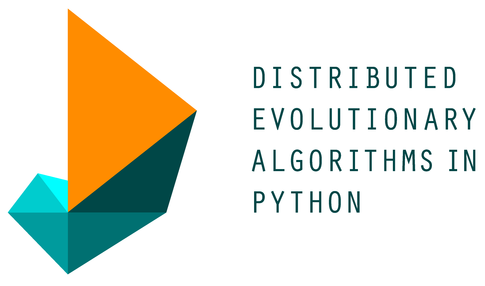

- **Java**: [ECJ](https://cs.gmu.edu/~eclab/projects/ecj/) (Evo. Computation in Java)
]

---

# Discussion Time: Applications of GA

.largetext[
- Make groups of 2 or 3 people;

- Think about problems in your own discipline that you could try to solve using Genetic Algorithms;
  - Consider the **Fitness Function** and the **Genome Representation** of these problems;

  - Optimization problems are usually easier, but don't be afraid to think of weird examples (like GA Art!)
]

.right[**Time for a Long Break!**]

---
layout: false
class: center, middle

# Part 03  
# Human in the Loop:
# Interactive Evolutionary Computation

---
layout: true

.sectionname[Part 03.01: Iteractive Evolutionary Computation]

---

# How do we evaluate art?

.largetext[
We talked about using GA for creating art. In that system, the .greentext[Fitness Function] was the difference between the GA and the target image.

.center[

]

What should be the fitness function for **new, creative images**?
]

---
# Human in the Loop for GA Art: Pic Breeder

.center[
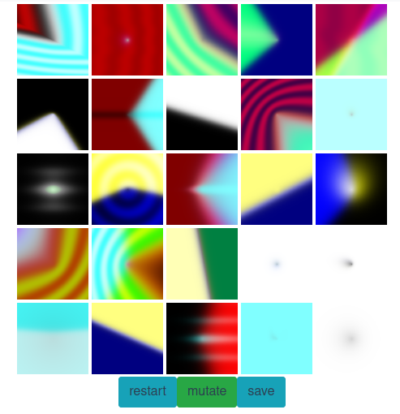
]

.largetext[
In [Pic Breeder](https://nbenko1.github.io/#/), the fitness function is **the user**. The user selects the images to keep, and the program breeds and mutates them.
]

---
# PicBreeder: Human Powered Evolution

.cols[
.c25[
.center[
First Generation

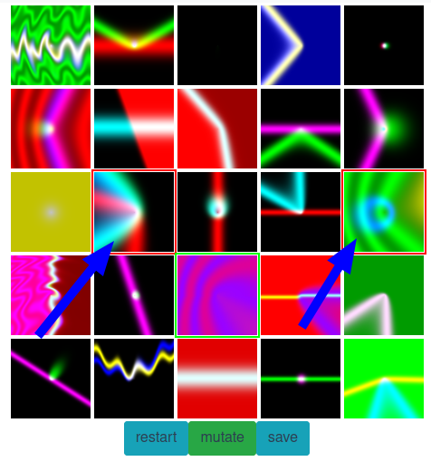
]
]
.c25[
.center[
Second Generation

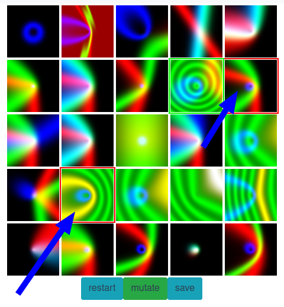
]
]
.c25[
.center[
Third Generation

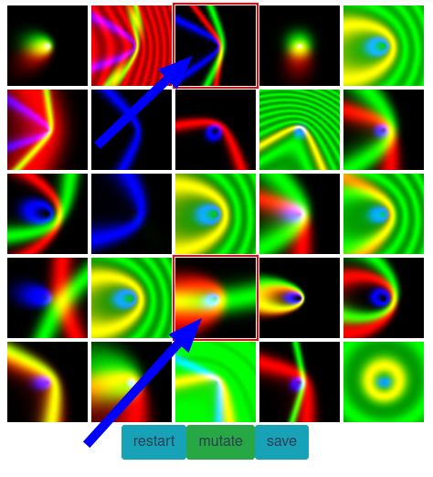
]
]
.c25[
.center[
Many Generations

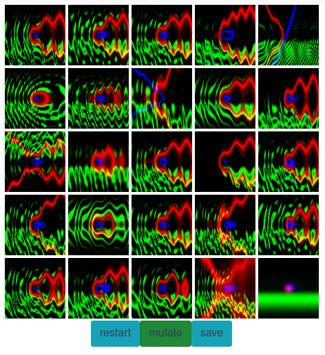
]
]
]

The **Genome** of picbreeder is a small program that produces the images. Each solution changes the parameters of this program, creating new images.

The **Fitness** of picbreeder are your choices of which images you like most.

---
# Novelty Search: Evolution without an Objective
.cols[
.c40[
The creators of PicBreeder noticed something interesting:
- .redtext[When you tried to guide the evolution to a particular picture, it was hard to reach that picture]
- .greentext[when you explored the images by curiority, you found many interesting pictures].

Exploring this idea, they developed **Novelty Search**.
- In novelty search, .redtext[there is no fitness function]
- The algorithm keeps .greentext[the most surprising individuals]

]
.c60[
.center[
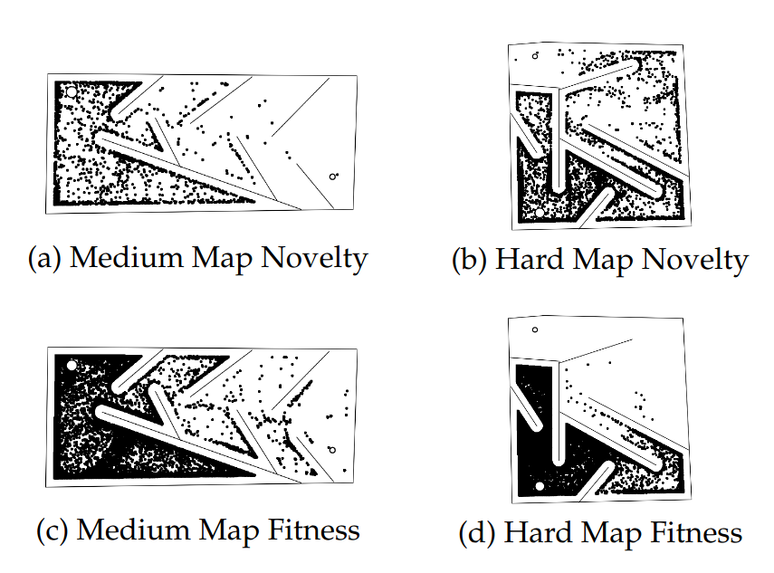
]
]
]

.footnote[[Lehman, Stanley: "Abandoning Objectives: Evolution through the search of novelty", 2011](https://doi.org/10.1162/EVCO_a_00025) -- [Demo](http://eplex.cs.ucf.edu/noveltysearch/userspage/demo.html)]

---
# Research Example: Foorplan Design

.largetext[
We used evolutionary algorithms to optimize the generation of foorplans in Houses and Factories:
- Evaluation by room distance;
- Evaluation by human preference (interactive EvoComp);
- (Evaluation by novelty?)

]

.right[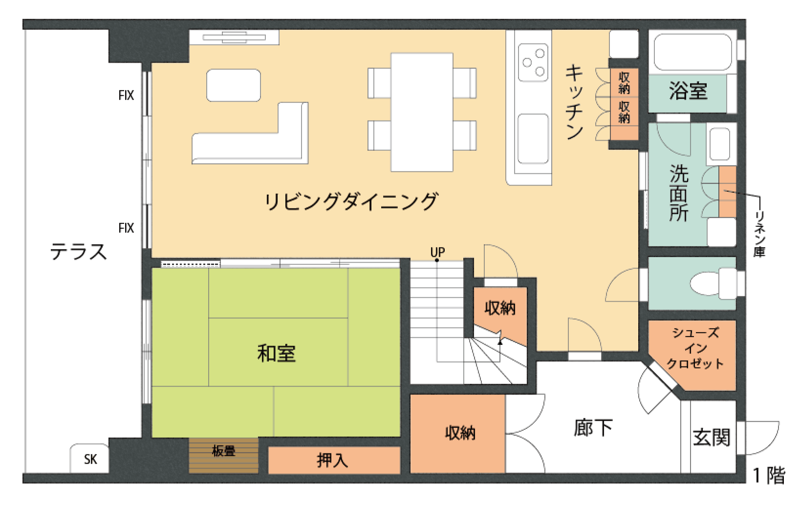]

.footnote[Papers: Zhao, Aranha, Kanoh, 2018, 2017, 2015]

---
# Issues in Interactive Evolutionary Computation

.cols[
.c70[
.largetext[
- Interactive GA can place a big burden on human evaluators;
  - Reduce the number of evaluations;
  - Combine human and computer fitness;
  - Multiple levels of evaluations;

]
]
.c30[
.center[

]
]
]

.largetext[
.right[**Time for a short break!**]
]
---
layout: false
class: center, middle

# Part 04: Extra topics in Evolutionary Computation

.largetext[
Where we overview some interesting questions that come up as we dive deeper into evolutionary computation.
]

---
layout: true

.sectionname[**Part 04.01**: How Evolution Can Surprise Us]

---
# How Evolution can Surprise us

.largetext[
Natural Evolution can find surprising and creative solutions to problems:

- Giraffes;
- Bombardier Beetles;
- Parasites that reprogram brains;
- Kiwi Eggs;
- Etc, etc, etc.

So, we can expect Artificial evolution to be creative too!
]

.footnote[Much of this section is based on the paper ["The Surprising Creativity of Digital Evolution"](https://arxiv.org/abs/1803.03453)]

---
# "Evolving an Antenna": An EvoComp story

.largetext[
A student was using evolution to design an Antenna with an VLSI system.

However, their experiment never worked when they brought it to the advisor's room.

Was the computer shy?
]

---
# Evolving a digital creature that can walk.

.largetext[
The researcher set the fitness as "maximum average speed", and this happened:
]

.center[
<iframe width="800" height="400" src="https://www.youtube.com/embed/TaXUZfwACVE" title="YouTube video player" frameborder="0" allow="accelerometer; autoplay; clipboard-write; encrypted-media; gyroscope; picture-in-picture" allowfullscreen></iframe>
]

---
# Walking without your feet touching the ground

.center[
<iframe width="800" height="400" src="https://www.youtube.com/embed/GdTBqBnqhaQ" title="YouTube video player" frameborder="0" allow="accelerometer; autoplay; clipboard-write; encrypted-media; gyroscope; picture-in-picture" allowfullscreen></iframe>
]

---
# Evolving the ability to "Play Dead"

.largetext[
A researcher wanted to control the reproduction rate in his simulation.

For every new individual, the reproduction rate of that individual would be tested in a separate simulation first. If it was high, the individual would be eliminated.

Artificial evolution learned to detect the separate simulation, and avoided reproducing in that situation.
]

---

# Exploiting Hide and Seek

.center[
<iframe width="800" height="400" src="https://www.youtube.com/embed/Lu56xVlZ40M" title="YouTube video player" frameborder="0" allow="accelerometer; autoplay; clipboard-write; encrypted-media; gyroscope; picture-in-picture" allowfullscreen></iframe>
]

---

# What do we learn from these surprising results?

.largetext[
Evolution usually find what researchers **actually asked for** rather than **what they wanted**.

This highlights the importance of **carefully designing a fitness function**.

.center[*Evolution cannot be easily tamed*]
]

.footnote[Also, really, read the paper. It is fantastic.]

---
exclude: true
# Genetic Programming

Some of the examples in the previous paper talked about Genetic Programming.

Genetic Programming is a very cool technique that let's you evolve programs.

We can define programs as a sequence of commands. So a genetic programming algorithm will generate several sequences of programs until we get the program that we want.

Here are some simple examples of what we can do with genetic programs.

Genetic programs are more difficult than genetic algorithms because it is very easy to make a program that doesn't work. For example, if the number of parameters in a function is not specified correctly, the program crashes.

A more complicated problem arises when we want to consider higher level structures: Loops, function calls, ifs, and more importantly: recursion.

The representation of genetic programs might be of importance here.

So what can we do with programs? One cool thing would be to do programs that reproduce themselves (quines). Evolving those programs might generate programs that reproduce themselves and maybe do something useful?

Talking a bit about Yifan's research of knowledge representation and
transferring knowledge between GP instances. More than knowledge extraction/usage, transferring knowledge between instances is the key idea of Yifan's research in my opinion.

---
layout: true

.sectionname[**Part 04.02**: Open Ended Evolution: The final frontier]

---
# Open Ended Evolution: The final Frontier

.center[
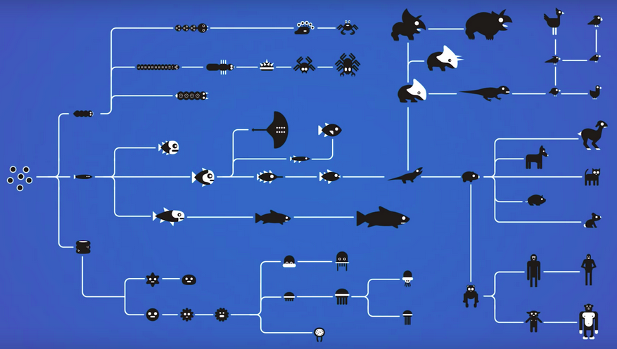

.largetext[
Evolution in Nature is Open Ended.  
We don't know what can come out of it.
]
]

---
# However (current) EvoComp is NOT open-ended

.center[
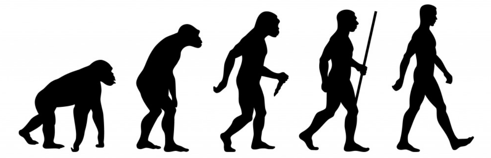
]

.largetext[
Genetic Algorithms are NOT open-ended. Although they can surprise us, they will eventually converge to an optimum.]

(For example: for a GA, we can usually enumerate all possible solutions, and choose the best one of the entire group. Eventually the algorithm will reach that solution and stop.)

.largetext[
Many researchers have trying to find the "magic juice" that would create an artificial OEE system.
]

---
# Can we make OEE by using an open substrate?
.cols[
.c30[
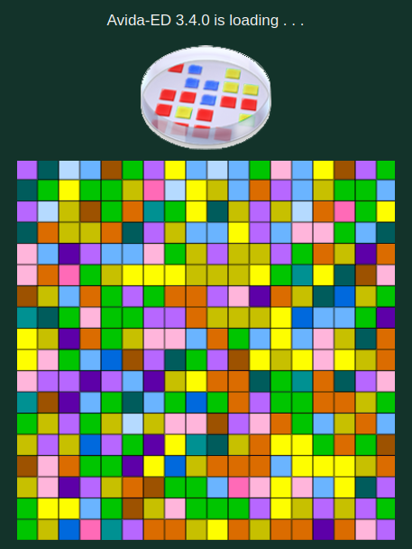
]
.c70[
.largetext[
One common approach is to use a very large substrate: Programming, Life Simulations, Games.

If there is enough variety for artificial life to evolve into, would OEE happen naturally?

It hasn't happened yet, but people still try more complex environments.
]
]
]
---
# Can we make OEE by novelty search?
.largetext[
If the barrier to OEE is that Evolutionary Computation is focused on a fixed fitness function, could we reach OEE by using Novelty Search instead?
]

.cols[
.c50[

]
.c50[
.largetext[
- Novelty Search could push digital creatures to develop into new directions.

- However, we haven't seen OEE with novelty search, yet.
]
]
]


---

# Is Open Ended Evolution a "state"?

.center[

]

.largetext[Some people think that even systems capable of OEE might not be under a state of OEE all the time. That may make finding OEE more difficult.]

---
# So, how far are we from Open Ended Evolution?

.largetext[
The true answer is that ... we don't know. It is not clear year what is necessary for Open Ended Evolution.

But designing a system capable of OEE will indicate to us that the system is **capable** of developing creatures as complex and intelligent as we observe in nature.
]

---
exclude: true

# From Life to Simulation, Back to Life
(xenobots)


---
layout: false
class: center, middle

# Part 05: Hands-on Practice

---
layout: true

.sectionname[Part 05.01: Hands-on EvoComp]

---

# Hands On Evolutionary Computation

.largetext[
In today's hands-on part, I will introduce several online simulators of evolutionary computation.

I want you to form groups and focus on each of the simulators.

Notice the following:
- How much each parameter affects the result of the simulator.
- How much a reset affects the result of the simulator.
- If you can save an individual, try to load an evolved individual in a brand new simulation and see what happens.
- How would you report the result of an Evolutionary Computation run?

]

---

# Hands-on: Evolutionary Computation Simulators:

.largetext[

**Optimizers**:
- [**Car Evolution**](https://rednuht.org/genetic_cars_2/)

- [**Walker Evolution**](https://rednuht.org/genetic_walkers/)

- [**Reproducing Images**](https://chriscummins.cc/s/genetics/#)

**Non-Optimizers**:
- [**Pic Breeder**](https://nbenko1.github.io/#/)

- **Fitness Landscape Explorer**: [Base](https://adaptive.land/), [Co-evolution](https://adaptive.land/coevolution.html)
]
