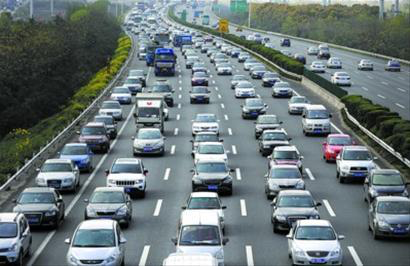

name: title
class: center, middle

# Introduction to Bioinspired Computation
## Lecture 03: Multi Agent Systems
Claus Aranha, University of Tsukuba

---
name: toc

# Outline for Today:

## 01 - Introduction to Multi Agent Systems
- What Are Multi Agent Systems?
- Simple MAS applications

## 02 - Applications of MAS
- Ongoing Researches using MAS

## 03 - Issues in Multi Agent Systems

## 04 - Hands-on Learning
- Models in GAMA Platform

---
layout: false
class: center, middle

# Part 01: Introduction to Multi Agent Systems

---
layout: true

.sectionname[**Part 01.01**: What are Multi Agent Systems?]

---

# Kamogawa River, Kyoto

.center[
]

---

# Kamogawa River, Kyoto

.center[

- Lots of Couples <3
- They stay an equal distance from each other.
]

---

# Kamogawa River, Kyoto

.center[

- (Winter) They stay an equal distance from each other.
]

---

# Kamogawa River, Kyoto

.center[

- (Summer) They stay an equal distance from each other.
]

---

# Kamogawa River, Kyoto

.center[

- (Even during COVID?) They stay an equal distance from each other.
]

---

# Why do they do this?

.largetext[
- There is no sign telling people where to seat.

- There is no one telling people to move.

- People don't talk to each other (much).

- People don't even think too hard about where to sit.
]

.boxyellow[
.boxlabel[Self-Organization]

A property of systems with multiple participants/components, where the participants will converge to a common behavior, without central
organization or even explicit agreement.

We see self-organization everywhere in the natural and human world.
]

---

# Self Organization is Everywhere among animals.

.center[
.cols[
.c50[

]
.c50[

]
]
]

---

# ... it is everywhere among humans too!

.center[
.cols[
.c50[

]
.c50[

]
]
]

---

# Discussion Time:

.largetext[
Think and suggest some systems (natural or artificial) that show self-organizing properties.

What are those properties? What decisions the system makes in a decentralized manner?
]

---

# Multi Agent Systems Research

.largetext[
`If each member of the group is acting based on their own information and initiative, how does coordination and cooperation emerge?`

]

- This is a research question that appears in **many** contexts:
  - Ecology, Politics, Economy, Engineering, Antropology, etc.

- **Multi Agent Systems** is a computational approach to model and understand these systems.

.right[]

---

# Multi Agent Systems: Agent and Environment

.cols[
.c60[
- An **Agent** is an entity that:
  - Obtains information from the environment;
  - Process that information as knowledge;
  - Acts in the environment based on that knowledge;

- Agents have limited ways to interact with the environment;

- Agents can act in fixed ways, or they can learn;

.center[]

- The definition of the environment is as important as the definition of the agent!

]
.c40[
.center[]

]
]

---

# Multi Agent Systems: Interaction among Agents

.cols[
.c50[
Multi-agent systems get really interesting (and complex!) when we consider how agents interact with each other.

- **Cooperation**: Agents have similar goals, actions benefit each other;

- **Competition**: The actions and goals of agents are in opposition;

- **Negotiation**: Agents can communicate with each other to choose how to act;

- And others...
]
.c50[

]
]

Because of these interactions, it is not uncommon for Multi Agent System research to happen in the realm of real or theoretical games!

---

# Multi-Agent Systems: Emergence

In particular, it is interesting to observe when large scale collaboration happens in multi agent systems without a clear leader structure.

When independent decision making leads to collective action from the system as a whole, we call it **Emergence**. (Emergent properties, Emergent Behavior)

.cols[
.c50[
  
]
.c50[
  
]
]

---

# Research directions in Multi Agent Systems

Research in Multi Agent Systems happens mainly through the creation, simulation
and study of .greentext[Models].

A model is a mathematical description, sometimes simplified, of something that
we want to study. For example, the model of bird flocking in Boids, composed of
the three rules that we discussed in the previous class.

Depending on how the model is used, we see two main types of MAS research:

1. **Model Design**: The focus is to design a MAS system that reproduces something
in the world that we are interested in. By validating and studying the MAS, we understand better its real world counterpart.

2. **Model Analysis**: The focus is to use a model that already exist and has been validated to explore variations in the initial conditions, and see how they affect the final result. This is of particular interest to policy analysis, engineering, etc.

---
layout: true

.sectionname[**Part 01.02**: MAS Research Example -- HOMINIDS Paper]

---

# "HOMINIDS: An agent-based spatial simulation model to evaluate behavioral patterns on early Pleistocene hominids"

Cameron S. Griffth, Byron L. Long, Jeanne M. Sept  
Ecological Modelling, 221, 2010

.largetext[
*"The Hominids ABM simulates the actions of two species of proto-human agents, who attempt to subsist by foraging on a spatially explicit landscape. The landscape is described based on empirical field data collected in East Africa."*

- Simulation based on archeological evidence;
- Using the simulator as basis for scientific hypothesis;
- Hypothesis may predict what to look for in the field;
]

---

# HOMINIDS Model

.cols[
.c60[

]
.c40[

]
]

---

# HOMINIDS Results

Differences in behavior were measured for different environments, species and abilities.

.center[]

---

# HOMINIDS Future -- Digital Archeology

.cols[
.c50[
- It would be nice to know the specific plants that grew in the area under study;

- Analysis of chemical biomarkers on archeological digs can tell us about leaf coverage and plant species;

- We collaborate with the Heriot Watt University (Scotland) to improve the HOMINIDS model;

- We expect even more reliable models from this research;

]
.c50[
.center[
Initial steps for the Chemistry Aware model.

]]
]

---
# Discussion: Multi Agent System Research

.largetext[
Let's gather in groups, and discuss research questions that we could ask using Multi Agent Systems. Consider the following points:

- What is the question that you would like to investigate?
- How do you design a model to answer that question?
  - What is the environment, and what are the agents?
  - How do the agents interact with the environment?
  - How do the agents interact with each other?
- Remember that a model does not need to be too complicated!
- What information do you want to observe from your model?
]

.right[**Time For a Break!**]

---
layout: true

.sectionname[**Part 01.03**: Bioinspired MAS]

---
# Bioinspired Algorithms using MAS

.largetext[

To finish this introduction to MAS models, let's see two optimization algorithms inspired by MAS models.

.greentext[Ant Colony Optimization]:  
Application of MAS principles for the Traveling Salesman Problem.

.greentext[Particle Swarm Optimization]:  
Application of MAS principles for Genetic Algorithms.
]

---
# Ant Colony Optimization

.cols[
.c60[
- Traveling Salesman Problem Reminder: Find a path that visits all the cities in a map with minimal cost.

- In nature, Ants find efficient paths to food sources when foraging.
  - When one ant finds a food source, they go back to the nest and leave pheronome signals.
  - Other ants follow the pheromone signal. If they find the food source, they reinforce the signal.

- Can we design an algorithm to solve TSP using the principles of ant foraging?
]
.c40[
.center[]
]
]

---
# Ant Colony Optimization Procedure

.cols[
.c70[
.largetext[
1. Initialize the procedure with **N** ant agents.

2. In the beginning, the ant agents **walk randomly** until all cities are visited

3. Each ant leaves pheromone on its path .redtext[inversely proportional to the path length]

4. All agents walk the path again.  
This time, the walk is weighted by the amount of pheromone.

5. Return to 3 until you find the shortest path.]
]
.c30[

]
]

---
# [Ant Colony Optimization Simulator](https://thiagodnf.github.io/aco-simulator/#)

.center[
.cols[
.c50[

]
.c50[

]
]]

---
# Particle Swarm Optimization

.largetext[
Particle Swarm Optimization is an **Optimization Algorithm**, like GAs.  
It is based on group behavior like **Boids**.
]

.cols[
.c50[
- A set of particles represent solutions to the optimization problem.

- Each particle has a **speed** and a **personal best**

- The entire group has a **global best**

- The speed of a particle is composed of three vectors:
  - Past speed;
  - Vector towards the **personal best**
  - Vector towards the **global best**

]
.c50[

]
]

---
# Characteristics of Particle Swarm Optimization (PSO)

Particularly good for:
- **Niche-aware Optimization**: Multi-modal problem, where there are several equally good solutions;
- **Dynamic Optimization**: Problems where the solution changes over time.

---
layout: false
class: center, middle

# Part 02: Multi Agent System Projects

---
layout: true

.sectionname[**Part 02.01**: Multi Agent System Projects]

---

# Multi Agent System Research Projects

In this section, I will introduce some of my research involving multi-agent systems.

---
# Evacuation and Infection Simulation

.largetext[
Using Multi Agent System to simulate the evacuation of earthquake and the transmission of infections disease.

- City Simulation Project Presentation;
]

---
exclude: true
# TODO
# Earthquake and Tsunami Evacuation Simulation

- Simulation of Evacuation process, important for Japan.
- Why do we simulate an Evacuation?
  - Policy testbed - Try new ideas
- Current Model -- Communication!
- Results -- Simulator that takes into account staff and Wireless Broadcast

---
exclude: true
# TODO
# Covid Infection Simulation

- More recently, COVID is very important.
- Many policy decisions: when to lockdown, how much to lockdown, when to allow events, event capacity limit, vaccine rollout, etc.
- Simulation of infection is important in this context
- SEIR Model
- But SEIR model does not have mobility
- Mobility Model

---
# AIWolf Project

.largetext[
Using Multi-Agent Systems to represent negotiation and trust-building in a social game context.

- AIWolf Crosslabs Presentation.
]

---
# Minecraft Settlement Generation

.largetext[
- Changing the subject a bit. Procedural Generation.
- Generation of a settlement in Minecraft
  - Gameplay and Aesthetics
  - Resource Management (Agent Simulation)
  - Narrative and Cultural Issues (Can also be simulated?)
- Results: 1st place 2021, 3rd place 2022
]

---
exclude: true
layout: false
class: center, middle

# Part 03: Issues in Multi Agent Systems

---
exclude: true
layout: true

.sectionname[**Part 03.01**: MAS Research Issues]

---
exclude: true

# Issues in Multi Agent Systems
- Representing Knowledge (AIWolf)
- Using data from humans for learning (Mobility Learning)

---
exclude: true

# Representing Knowledge in Multi Agent Systems

- When two people interact in a social context, what they know about each other, and about the world, is an important factor.
- However, representing the knowledge of Agents in a MAS is a hard, still untreated problem

---
exclude: true

# Representing Knowledge in Multi Agent Systems

- Knowledge as Logic Statements
- Knowledge as Databases
- Knowledge as Rules

But what about Learning? And Circular Knowledge?

---
exclude: true

# The AIWolf Project

It has many objectives, but I particularly find the representation of knowledge to be a key part of the problem.

---
exclude: true

# Using Data in Multi Agent Systems

We use data for:
- Validating existing systems
- Setting Parameters in New Systems

---
layout: false
class: center, middle

# Part 04: Hands on Learning of Multi Agent Systems

---
layout: true

.sectionname[**Part 04.01**: Hands on Learning]

---

# MAS platforms

- Gama: https://gama-platform.org/ -- Spatially Explicit
- Netlogo: https://ccl.northwestern.edu/netlogo/ -- Very traditional
- MESA: https://mesa.readthedocs.io/en/latest/ -- Python
- artisoc: https://mas.kke.co.jp/en/artisoc4/ -- Japanese, Mac/Windows only, not opensource

---

# GAMA Platform Tutorial

- What is GAMA, in more detail?
- How to use the platform

---

# GAMA Language Tutorial

- Predator Prey Overview
- Changing one thing in the model

---

# What I want you to do

- Study the different models, read what they do.
- Experiment with a few of the models, changing the values
- If you feel adventurous, try to improve on the model
  - For example, add a "Water" tile in the prey model that neither prey or predator can move to.
