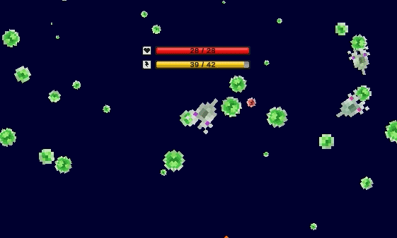

name: title
class: center, middle

# Introduction to Bioinspired Computation
## Lecture 04: Neural Networks
Claus Aranha, University of Tsukuba

.center[

]

---

# Outline for Today

Today we will take a stab at a huge topic: Artificial Neural Networks.

We will focus on how ANNs relate to Bioinspired Computation, Evolutionary Computation, and Artificial Life. We will also talk a little bit about
Reinforcement Learning.

The recent and popular applicaitons of Neural Networks to Natural Language
and Image Generation are not on the menu today, but we can talk about
it if you want during the discussion sessions.

---
name: toc

# Outline for Today:

## 01 - Basics of Artificial Neural Networks
- Concepts of ANNs, Application to Agriculture

## 02 - Neural Networks and Evolutionary Computation
- Neuroevolution of weights and topology, Application to Robot Morphology

## 03 - Reinforcement Learning
- Concepts of RL, before and after ANNs, Applications to Games and MAS

## 04 - Neural Networks and Artificial Life
- Neuro Cellular Automata, Regenerative Alife

## 05 - Hands on session: The Bibites

---
layout: false
class: center, middle

# Part 01: Introduction to Neural Networks

---
layout: true

.sectionname[**Part 01.01**: What are Neural Networks?]

---

# Bioinspired Computation: From Neurons to Perceptrons

The roots of neural networks go back to the 1960ies. Researchers of the time theorized that it should be possible to create intelligent machines, if we could emulate the working of the brain.

With that goal, they created the **perceptron**, a computational function that replicated the working of the neuron as it was understood at the time.

How does the perceptron works?

---

# Artificial Neural networks

- Of course, the brain is not composed of a single neuron, so usually we tie together the perceptrons into *layers* where one layer sends knowledge to the next one.

- Universal approximator

- The more the better: Deep Neural Networks

- Layer Engineering:
  - For images: Convolution Neural Networks
  - For continuous data: Recurrent Neural Networks
  - There is much more layer engineering that can be done
  - We will come back to this in Neuroevolution

---

# How to Train your Neural Network

- Backpropagation
- Training and Testing Data
- Overfitting (and other problems / limitations)

---

# Example: OPERA Project

---

# Discussion
- What neural Network uses do you know?
- What kinds of things do you think/want to use neural networks for?

---
layout: false
class: center, middle

# Part 02: Neural Networks and Evolutionary Computation

---
layout: true

.sectionname[Part 02.01: NeuroEvolution]

---

# Mixing Evolutionary Computation and Neural Networks

- NeuroEvolution
- Optimization of ANN weights (nevergrad)
- Optimization of ANN layer structure (architecture search)

---

# NeuroEvolution Example: Soft Robots

---
layout: false
class: center, middle

# Part 03: Reinforcement Learning

---
layout: true

.sectionname[Part 03.01: Reinforcement Learning]

---

# What is Reinforcement Learning?
- Basic Idea: Pavlov dogs
- Initial Computational Approaches: Rewards tables
- What if we replace the reward tables with a neural network
  - Simialr to Classification / Regression problem
  - Keyword: Policy network
- What if we predict the reward from states?
  - Keyword: Reward Network
- Example: Alpha-Go, Other game playing AI, AI Gym

---
layout: false
class: center, middle

# Part 04: Neural Networks and Artificial Life

---
layout: true

.right[Part 04.01: ANNs and Alife]

---

# Neurocelular Automata

- What if we used an AI to learn rules for the game of life?
- Gecko Neurocellular Automata
- Bibites Project (Evo + NN + Alife + MAS)

---
layout: false
class: center, middle

# Part 05: Hands On
- The Bibites (Alife, Evo, Multi-Agents and Neural Networks)
- What are the bibites
- Download and Interface
- How can we use the Bibites?
- Competition
